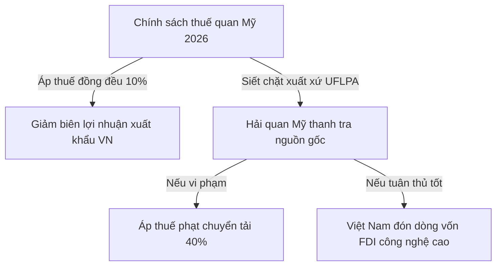

# BÁO CÁO CHIẾN LƯỢC: BỐI CẢNH KINH TẾ - CHÍNH TRỊ TOÀN CẦU 2026 & TÁC ĐỘNG TỚI DOANH NGHIỆP VIỆT NAM

**Đơn vị thực hiện:** Nhóm Chuyên gia Phân tích Vĩ mô Antigravity  
**Ngày báo cáo:** 29 tháng 05 năm 2026  
**Đối tượng áp dụng:** Doanh nghiệp Việt Nam thuộc các ngành trọng điểm: Xuất khẩu (Dệt may, Da giày, Nông-lâm-thủy sản), Điện tử & Bán dẫn, Logistics & Chuỗi cung ứng.

---

## 1. Executive Summary (Tóm tắt điều hành)

Năm 2026 định hình một bối cảnh kinh tế - chính trị toàn cầu đầy biến động, được đặc trưng bởi **"sự dịch chuyển cấu trúc sâu sắc, chủ nghĩa bảo hộ gia tăng và các quy định xanh bắt buộc"**. Toàn cầu hóa truyền thống đang bị thay thế bằng mô hình liên kết chuỗi cung ứng theo khối địa chính trị (friend-shoring) và khu vực hóa.

### Các xung lực vĩ mô cốt lõi năm 2026:
1.  **Chính sách Thuế quan Bảo hộ của Mỹ (Trump 2.0):** Mỹ áp dụng thuế quan đồng đều 10% đối với hầu hết hàng nhập khẩu toàn cầu từ đầu năm 2026, gây áp lực trực tiếp lên biên lợi nhuận của hàng xuất khẩu Việt Nam và làm lạm phát Mỹ neo cao ở mức 3,8%, buộc Fed duy trì lãi suất ở ngưỡng 3,5% - 3,75%.
2.  **Cột mốc xanh bắt buộc tại EU:** Cơ chế điều chỉnh biên giới carbon (CBAM) chính thức bước vào giai đoạn vận hành thực tế có tính tài chính từ ngày 1/1/2026; cùng với đó là thời hạn bắt buộc thực thi Quy định chống phá rừng (EUDR) vào ngày 30/12/2026 và việc áp dụng 100% phụ phí khí thải hàng hải EU ETS.
3.  **Sự chuyển dịch chuỗi cung ứng công nghệ tại Đông Nam Á & Trung Quốc:** Trung Quốc bước vào Kế hoạch 5 năm lần thứ 15 với mục tiêu GDP 4.5% - 5.0% và tập trung tự chủ bán dẫn (yêu cầu dùng 50% thiết bị nội địa). Làn sóng FDI "China Plus One" dịch chuyển dồn dập vào ASEAN vượt mốc 200 tỷ USD/năm, biến khu vực này thành cứ điểm công nghệ cao thế hệ mới.
4.  **Khủng hoảng logistics ở Trung Đông:** Căng thẳng Mỹ - Iran leo thang gây phong tỏa eo biển Hormuz; lộ trình tàu biển vòng qua Mũi Hảo Vọng trở thành "trạng thái bình thường mới" kéo theo giá dầu thô vượt $120/thùng và chi phí cước biển đạt đỉnh kỷ lục.

### Đánh giá tổng quan đối với Việt Nam:
Tác động tổng hợp là **TRUNG BÌNH - CAO**. Việt Nam đứng trước **"Thử thách ngắn hạn về logistics và rào cản thương mại, nhưng sở hữu cơ hội lịch sử dài hạn để nâng cấp vị thế trong chuỗi cung ứng bán dẫn toàn cầu"** nhờ các động lực pháp lý nội địa mạnh mẽ như Luật Công nghiệp Công nghệ số và các hiệp định thương mại thế hệ mới (EVFTA, CEPA Việt Nam - UAE).

---

## 2. Bảng so sánh 5 khu vực địa chính trị trọng điểm năm 2026

| Khu vực | Xu hướng vĩ mô chính | Rủi ro cốt lõi đối với Việt Nam | Cơ hội lớn nhất cho Việt Nam | Mức độ tác động | Khuyến nghị then chốt |
| :--- | :--- | :--- | :--- | :--- | :--- |
| **Mỹ (USA)** | Thuế quan bảo hộ đồng đều 10%; Lạm phát 3,8%, Fed giữ lãi suất cao 3,5%-3,75%; Cạnh tranh công nghệ Mỹ - Trung kéo dài. | Bị áp thuế phạt chuyển tải (lên tới 40%) nếu không minh bạch nguồn gốc chuỗi cung ứng; sức mua người tiêu dùng Mỹ giảm. | Đón làn sóng chuyển dịch chuỗi cung ứng công nghệ cao; tối ưu hóa Luật Công nghiệp Công nghệ số (thuế ưu đãi 5% trong 37 năm). | **CAO** *(High)* | Chuyển đổi mô hình sản xuất từ CMT sang ODM/OBM; minh bạch hóa nguồn gốc xuất xứ phi Trung Quốc để tránh thuế phạt. |
| **EU** | Chuyển sang "Bảo hộ xanh"; thực thi bắt buộc CBAM (1/1/2026) và EUDR (30/12/2026); áp dụng 100% phụ phí hàng hải EU ETS. | Rủi ro nông sản bị chặn do EUDR/Thẻ vàng IUU chưa được gỡ; cước tàu biển sang EU tăng vọt do phụ phí carbon EU ETS cao. | Lợi thế thuế quan 0% vượt trội từ EVFTA (năm thứ 6); "khoảng thở" lớn cho SME do EU nới lỏng CSRD và CSDDD sang 2028-2029. | **CAO** *(High)* | Số hóa định vị GPS vùng trồng cho nông nghiệp; đẩy nhanh chứng chỉ xanh (GRS, OEKO-TEX) để giữ phân khúc cao cấp. |
| **Trung Quốc** | GDP mục tiêu 4,5%-5,0%; đẩy mạnh tự chủ bán dẫn và pin thể rắn; giảm hoàn thuế xuất khẩu pin; RMB duy trì mạnh và ổn định. | Cạnh tranh khốc liệt tại nội địa từ các sàn TMĐT giá rẻ (Temu, Shein); GACC siết chặt tiêu chuẩn kỹ thuật (SPS) nông sản thô. | Nhập khẩu nguyên vật liệu xanh/cao cấp từ Trung Quốc để đáp ứng chuẩn EU/Mỹ; hạ giá thành vận chuyển nhờ đường sắt liên vận khổ 1.435mm. | **TRUNG BÌNH** *(Medium)* | Hợp tác liên doanh phát triển kho thông minh AI; chuyển hướng xuất khẩu nông sản chất lượng cao chính ngạch thay vì tiểu ngạch. |
| **Đông Nam Á (SEA)** | FDI nội khối >200 tỷ USD/năm; dịch chuyển chuỗi cung ứng chất lượng cao; thực thi kinh tế số DEFA, hải quan điện tử ASW. | Cạnh tranh thu hút FDI công nghệ cao cực lớn với Malaysia (đóng gói chiplet) và Thái Lan (chính sách xe điện EV 3.5). | Hợp tác phân khúc thiết kế chip AI với Singapore/Malaysia; thông quan siêu tốc qua hải quan số ASW giảm hao hụt nông thủy sản. | **CAO** *(High)* | Liên kết chuỗi giá trị bổ trợ bán dẫn khu vực; số hóa quy trình logistics và áp dụng các tiêu chuẩn kinh tế số DEFA. |
| **Trung Đông** | Leo thang xung đột Mỹ-Iran; phong tỏa eo biển Hormuz; dầu thô vượt $120/thùng; vận tải đi vòng qua Mũi Hảo Vọng. | Chi phí cước tàu tăng 2-3 lần; thời gian giao hàng sang Mỹ/EU kéo dài thêm 10-20 ngày; thiếu hụt vỏ container rỗng tại cảng. | Hiệp định CEPA Việt Nam - UAE (có hiệu lực 2/2026) xóa 99% thuế; mở rộng thị trường Halal theo Nghị định 127/2026/NĐ-CP. | **CAO** *(High)* | Chuyển đổi điều khoản thương mại từ CIF sang FOB để đẩy chi phí cước biển sang bên mua; đa dạng hóa lộ trình Sea-Air qua Dubai. |

---

## 3. Phân tích sâu sắc theo từng khu vực địa lý

### 3.1. Khu vực Mỹ (USA): Lợi ích công nghệ song hành áp lực thuế quan bảo hộ
Năm 2026, chính quyền Mỹ áp dụng **Mục 122 của Đạo luật Thương mại năm 1974** để thiết lập mức thuế quan đồng đều 10% đối với hầu hết hàng nhập khẩu. Đây là một đòn giáng mạnh vào biên lợi nhuận của các doanh nghiệp xuất khẩu dệt may và da giày Việt Nam vốn có biên lợi nhuận mỏng (thường chỉ 5%-8%).



*   **Rủi ro trừng phạt xuất xứ:** Hải quan Mỹ nâng cao tần suất thanh tra chuỗi cung ứng dệt may và pin năng lượng mặt trời theo Đạo luật Phòng chống Lao động Cưỡng bức Duy Ngô Nhĩ (UFLPA). Các doanh nghiệp sử dụng nguyên liệu đầu vào từ Tân Cương hoặc thực hiện lắp ráp gia công đơn giản từ linh kiện Trung Quốc có nguy cơ bị áp thuế chống lẩn tránh lên tới 40%.
*   **Cú hích dịch chuyển chuỗi cung ứng bán dẫn:** Ngược lại với xuất khẩu truyền thống, ngành Điện tử & Bán dẫn Việt Nam đang bùng nổ mạnh mẽ. Tính đến năm 2026, tổng vốn FDI lũy kế đổ vào ngành bán dẫn Việt Nam đã đạt mốc 14-16 tỷ USD, nổi bật với siêu dự án 4 tỷ USD của Samsung tại Thái Nguyên và dự án sản xuất bán dẫn tự chủ của Viettel. 
*   **Đòn bẩy pháp lý nội địa:** **Luật Công nghiệp Công nghệ số** của Việt Nam (hiệu lực từ 1/1/2026) cung cấp mức ưu đãi thuế thu nhập doanh nghiệp kỷ lục: **5% trong suốt 37 năm** đối với các dự án thiết kế và sản xuất chip bán dẫn thế hệ mới. Điều này cộng hưởng với làn sóng "Friend-shoring" của Mỹ tạo nên thời cơ chín muồi để Việt Nam nâng cao chuỗi giá trị bán dẫn toàn cầu.

---

### 3.2. Khu vực Liên minh Châu Âu (EU): Kỷ nguyên "Bảo hộ xanh" bắt đầu có hiệu lực pháp lý
EU trong năm 2026 đã chuyển dịch toàn diện sang mô hình "Clean Industrial Deal". Mặc dù Ủy ban Châu Âu (EC) ban hành gói cải cách **Omnibus I (Directive (EU) 2026/470)** nới lỏng tạm thời tiến trình áp dụng CSRD và CSDDD cho các doanh nghiệp nhỏ và vừa (SME) nhằm tạo "khoảng thở", các quy định kỹ thuật mang tính bắt buộc tài chính khác lại siết chặt kỷ lục:

*   **CBAM đi vào giai đoạn Definitive Phase (1/1/2026):** Các doanh nghiệp xuất khẩu sắt, thép, xi măng, nhôm, phân bón của Việt Nam sang EU bắt đầu phải thực hiện nghĩa vụ khai báo lượng carbon phát thải thực tế và mua chứng chỉ CBAM đầu tiên (hạn chót nộp tiền vào tháng 2/2027 cho lượng phát thải năm 2026).
*   **Hạn chót thực thi EUDR (30/12/2026):** EC kiên quyết không lùi thời hạn. Đến cuối năm 2026, toàn bộ nông sản như cà phê, cao su, gỗ xuất khẩu sang EU phải chứng minh không có nguồn gốc từ đất rừng bị phá sau năm 2020 bằng dữ liệu tọa độ GPS vùng trồng chuẩn xác.
*   **Cấm tiêu hủy hàng may mặc chưa bán:** Bắt đầu có hiệu lực từ ngày 19/7/2026 đối với các doanh nghiệp lớn tại EU, gián tiếp buộc các nhà máy sản xuất tại Việt Nam phải chuyển đổi sang thiết kế sinh thái (ESPR) và chuẩn bị tích hợp Hộ chiếu sản phẩm số (DPP) từ tháng 7/2026.
*   **IUU Thẻ vàng chưa gỡ:** Sau đợt thanh tra lần thứ 5 vào tháng 3/2026, EU tiếp tục giữ nguyên thẻ vàng IUU đối với thủy sản Việt Nam, khiến 100% container thủy sản bị giữ lại kiểm tra nguồn gốc tại cảng EU, kéo dài thời gian thông quan từ 2 - 3 tuần và phát sinh chi phí lưu kho bãi khổng lồ.

---

### 3.3. Khu vực Trung Quốc: Sự định hình lại chuỗi cung ứng thượng nguồn
Trung Quốc bước vào Kế hoạch 5 năm lần thứ 15 (2026-2030) tập trung vào phát triển lực lượng sản xuất mới chất lượng cao. PBOC duy trì đồng Nhân dân tệ (RMB) mạnh giúp giá trị đồng tiền ổn định, giảm sức ép phá giá nhưng gián tiếp làm tăng chi phí nhập khẩu nguyên phụ liệu của các doanh nghiệp Việt Nam mua từ Trung Quốc.

*   **Cạnh tranh thương mại điện tử giá rẻ:** Sức mua nội địa Trung Quốc yếu đẩy lượng hàng hóa tiêu dùng tồn kho tràn sang các nước láng giềng. Các sàn thương mại điện tử giá rẻ như Temu, Shein sử dụng mô hình tối ưu logistics biên giới gây áp lực cạnh tranh nghẹt thở ngay tại thị trường nội địa Việt Nam đối với hàng may mặc, đồ gia dụng.
*   **Chuyển đổi công nghệ pin & bán dẫn:** Việc Bắc Kinh giảm hoàn thuế VAT xuất khẩu pin xuống 6% từ tháng 4/2026 nhằm kiểm soát tình trạng "cuộn nội" (price wars) nội địa đã tạo cơ hội cho Việt Nam thu hút các dự án sản xuất pin cao cấp sang thiết lập nhà máy trong nước.
*   **Điểm sáng đường sắt liên vận Á - Âu:** Tuyến đường sắt khổ tiêu chuẩn (1.435mm) Lào Cai - Hà Nội - Hải Phòng và Lạng Sơn - Hà Nội đi vào vận hành kết nối trực tiếp chuỗi cung ứng đường sắt Trung Quốc, giúp doanh nghiệp Việt giảm 30%-40% thời gian vận chuyển nguyên vật liệu thượng nguồn so với đường biển truyền thống.

---

### 3.4. Khu vực Đông Nam Á (SEA): Cuộc đua FDI khốc liệt và số hóa nội khối
ASEAN duy trì vị thế điểm nóng thu hút dòng vốn đầu tư toàn cầu với làn sóng FDI vượt 200 tỷ USD/năm. Tuy nhiên, Việt Nam đang đối mặt với sự cạnh tranh phân cực từ các quốc gia láng giềng:

*   **Malaysia bứt phá trong đóng gói chip tiên tiến:** Malaysia đầu tư mạnh mẽ trong Ngân sách 2026 với gói 92 triệu RM tài trợ R&D cho công nghệ đóng gói chiplet 2.5D/3D và quỹ 550 triệu RM phát triển hệ sinh thái bán dẫn nội địa, gián tiếp thu hút các tập đoàn bán dẫn hàng đầu tránh xa Việt Nam do hạ tầng của họ hoàn thiện hơn.
*   **Thái Lan siết chặt chính sách xe điện EV 3.5:** Quy định bắt buộc tỷ lệ lắp ráp bù đắp nội địa đạt mức 1:2 trong năm 2026 và 1:3 vào năm 2027. Thái Lan tiếp tục duy trì ưu đãi thuế tiêu thụ đặc biệt chỉ 2% cho xe thuần điện (BEV), biến nước này thành công xưởng xe điện độc tôn của khu vực.
*   **Điểm sáng Hiệp định Khung Kinh tế Số ASEAN (DEFA):** Các đợt đàm phán DEFA năm 2026 đạt tiến triển lớn. Cơ chế một cửa ASEAN (ASW) tích hợp AI/Blockchain giúp cắt giảm 60% thời gian thông quan nội khối, mở ra cơ hội vàng cho xuất khẩu nông sản tươi sống của Việt Nam sang Singapore và Malaysia.

---

### 3.5. Khu vực Trung Đông: Điểm nóng địa chính trị và khủng hoảng Logistics
Căng thẳng xung đột leo thang đỉnh điểm giữa Mỹ và Iran từ cuối tháng 2/2026 dẫn đến việc phong tỏa eo biển Hormuz - huyết mạch năng lượng thế giới. Việc đi vòng qua Mũi Hảo Vọng đã trở thành "trạng thái bình thường mới" đối với tất cả các tuyến tàu đi Mỹ và EU.

*   **Cú sốc chi phí logistics đường biển:** Thời gian hải trình tăng thêm 10 - 20 ngày khiến cước tàu biển giao ngay từ Việt Nam đi Mỹ/EU tăng vọt 200% - 300%. Mỗi chuyến đi phát sinh trung bình 1 triệu USD chi phí vận hành cho hãng tàu, đẩy phụ phí container lạnh lên mức kỷ lục.
*   **Phụ phí carbon cộng dồn:** Việc đi vòng làm lượng tiêu thụ nhiên liệu tăng 35%, gián tiếp đẩy chi phí thuế carbon theo cơ chế EU ETS hàng hải (áp dụng 100% từ 1/1/2026) lên gấp đôi, gây áp lực trực tiếp lên biên lợi nhuận của doanh nghiệp Việt nếu ký hợp đồng dạng CIF.
*   **Cơ hội lịch sử từ Hiệp định CEPA Việt Nam - UAE:** Có hiệu lực chính thức từ tháng 2/2026, UAE cam kết xóa bỏ đến 99% dòng thuế cho hàng hóa Việt Nam. UAE đóng vai trò là cửa ngõ tái xuất khẩu cực kỳ quan trọng vào toàn bộ khu vực GCC. Kết hợp với **Nghị định 127/2026/NĐ-CP** ban hành khung pháp lý chứng nhận Halal Việt Nam thúc đẩy "Halal Xanh", mở toang cánh cửa vào thị trường Hồi giáo toàn cầu trị giá hàng nghìn tỷ USD.

---

## 4. Khuyến nghị hành động chiến lược cho doanh nghiệp Việt Nam

Dựa trên các phân tích chi tiết của 5 khu vực địa lý, chúng tôi đề xuất các khuyến nghị hành động cụ thể chia theo 3 nhóm ngành trọng điểm:

```carousel
### Nhóm ngành Xuất khẩu
(Dệt may, Da giày, Nông-lâm-thủy sản)

1. **Minh bạch chuỗi cung ứng phi Trung Quốc:** Khẩn trương rà soát toàn bộ nguồn gốc nguyên vật liệu (vải, da, sợi, gỗ). Chuyển đổi nhà cung cấp đầu vào sang các nước ASEAN có FTA hoặc tự sản xuất trong nước nhằm vượt qua các bộ lọc UFLPA của Mỹ và quy định xuất xứ "Fabric Forward" của EVFTA.
2. **Số hóa tọa độ GPS vùng trồng đáp ứng EUDR:** Phối hợp chặt chẽ với chính quyền địa phương và các hợp tác xã nông nghiệp thiết lập hệ thống bản đồ định vị GPS số hóa trước hạn chót 30/12/2026. Chủ động áp dụng công nghệ truy xuất nguồn gốc bằng mã QR cho chuỗi cung ứng cà phê, cao su và gỗ.
3. **Khai thác cửa ngõ UAE và thị trường Halal Xanh:** Tận dụng tối đa ưu đãi thuế từ CEPA Việt Nam - UAE để phân phối nông sản sang Trung Đông. Xây dựng quy trình sản xuất đạt chứng nhận Halal theo tiêu chuẩn mới của Nghị định 127/2026/NĐ-CP để tiếp cận thị trường các nước Hồi giáo giàu có trong GCC.
<!-- slide -->
### Nhóm ngành Điện tử & Bán dẫn
(FDI Bán dẫn, Thiết kế, Lắp ráp, Đóng gói)

1. **Tận dụng tối đa Luật Công nghiệp Công nghệ số:** Đăng ký ngay các dự án nghiên cứu, thiết kế, đóng gói bán dẫn mới để hưởng mức ưu đãi thuế thu nhập doanh nghiệp **5% trong suốt 37 năm** cùng các gói hỗ trợ tiền điện, tiền thuê đất công nghiệp tại các khu công nghệ cao (Hòa Lạc, TP.HCM, Đà Nẵng).
2. **Nâng cấp tiêu chuẩn xanh nhà máy vệ tinh:** Mặc dù EU nới lỏng CSRD/CSDDD, các tập đoàn đa quốc gia vẫn yêu cầu chuỗi cung ứng đạt Net-Zero (Scope 1 và Scope 2). Doanh nghiệp cần lắp đặt hệ thống điện mặt trời mái nhà và nâng cấp hệ thống quản trị năng lượng thông minh để duy trì vị thế nhà cung cấp cấp 1 (Tier 1).
3. **Hợp tác liên minh nguồn nhân lực chất lượng cao:** Thiết lập liên kết đào tạo ngắn hạn và dài hạn với các đại học lớn để giải quyết bài toán thiếu hụt kỹ sư thiết kế và đóng gói chip. Đưa ra các chính sách đãi ngộ vượt trội ngăn chặn hiện tượng "chảy máu chất xám" sang các nước đối thủ như Malaysia.
<!-- slide -->
### Nhóm ngành Logistics & Chuỗi cung ứng
(Vận tải đa phương thức, Kho bãi, Hạ tầng số)

1. **Chuyển dịch điều khoản thương mại từ CIF sang FOB:** Chủ động chuyển đổi các hợp đồng xuất khẩu sang dạng FOB (giao hàng tại mạn tàu Việt Nam) để chuyển giao rủi ro cước vận tải biển tăng vọt và gánh nặng thuế carbon EU ETS hàng hải cho đối tác Mỹ/EU chịu trách nhiệm.
2. **Đa dạng hóa lộ trình đa phương thức (Sea-Air & Đường sắt liên vận):** Cắt giảm phụ thuộc hoàn toàn vào đường biển đi qua Mũi Hảo Vọng bằng cách kết hợp vận tải biển đến Dubai/Bangkok sau đó trung chuyển bằng đường hàng không (Sea-Air) sang EU/Mỹ. Sử dụng hiệu quả tuyến đường sắt liên vận khổ tiêu chuẩn qua Trung Quốc đi Á - Âu để rút ngắn thời gian giao hàng còn 15-20 ngày.
3. **Ứng dụng AI/IoT tối ưu hóa vỏ container và kho thông minh:** Hợp tác liên doanh với các doanh nghiệp công nghệ lớn của Trung Quốc hoặc Singapore để xây dựng hệ thống kho vận thông minh ứng dụng AI dự báo dòng container rỗng, giảm thiểu hao hụt hàng nông sản tươi sống và tối ưu hóa thời gian quay vòng container.
```

---

## 5. Kết luận chiến lược

Năm 2026 không dành cho những doanh nghiệp thụ động chờ đợi thị trường ổn định. **"Khủng hoảng logistics là phép thử cho năng lực thích ứng nhanh, và các rào cản xanh chính là động lực bắt buộc để doanh nghiệp Việt Nam nâng cấp công nghệ"**. Những doanh nghiệp chủ động số hóa chuỗi cung ứng, minh bạch hóa xuất xứ nguồn gốc và chuyển đổi mô hình sản xuất sang hướng bền vững sẽ không chỉ đứng vững trước các cơn gió ngược vĩ mô mà còn bứt phá chiếm lĩnh các thị phần cao cấp toàn cầu.

**Khuyến nghị chung:** Doanh nghiệp cần lập ngay **Ban phản ứng nhanh vĩ mô (Macro Rapid Response Taskforce)** để theo dõi hàng tuần biến động thuế quan Mỹ, chi phí cước biển Trung Đông và tiến độ tuân thủ tiêu chuẩn xanh EUDR/CBAM nhằm điều chỉnh kế hoạch kinh doanh kịp thời.
