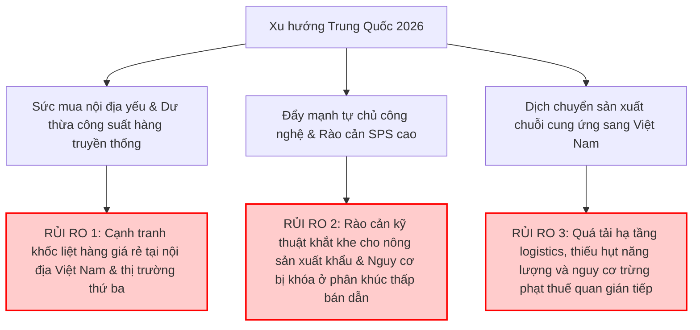

# BÁO CÁO PHÂN TÍCH KINH TẾ - CHÍNH TRỊ TRUNG QUỐC NĂM 2026
## TÁC ĐỘNG CHIẾN LƯỢC ĐỐI VỚI DOANH NGHIỆP VIỆT NAM

*Người thực hiện: Chuyên gia Phân tích Kinh tế - Chính trị Quốc tế (Antigravity)*
*Thời điểm phân tích: Tháng 05/2026*
*Bối cảnh: Năm khởi đầu Kế hoạch 5 năm lần thứ 15 (2026–2030) của Trung Quốc*

---

## I. TÓM TẮT TỔNG QUAN KHU VỰC TRUNG QUỐC NĂM 2026

Năm 2026 đánh dấu một chương mới trong chiến lược phát triển của Trung Quốc khi nước này chính thức bước vào **Kế hoạch 5 năm lần thứ 15 (2026–2030)**. Trong bối cảnh môi trường địa chính trị quốc tế đầy biến động và áp lực cạnh tranh chiến lược từ Mỹ và phương Tây gia tăng, Bắc Kinh đã định hình một mô hình kinh tế mới mang tính "thực tế" (pragmatic) và "tự chủ cường độ cao".

Thay vì theo đuổi tăng trưởng nóng bằng mọi giá hoặc tung ra các gói kích thích kinh tế khổng lồ mang tính bong bóng, chính phủ Trung Quốc năm 2026 tập trung ưu tiên sự ổn định vĩ mô, quản trị rủi ro hệ thống (đặc biệt là bất động sản và nợ chính quyền địa phương), và đặc biệt là chuyển dịch mạnh mẽ sang **"Lực lượng sản xuất chất lượng mới" (New Quality Productive Forces)**. 

### Các Chỉ Số Kinh Tế Vĩ Mô Định Hướng Năm 2026:
*   **Mục tiêu tăng trưởng GDP:** Đặt ở mức thực tế từ **4.5% đến 5.0%**, phản ánh sự thừa nhận của giới lãnh đạo về các thách thức cấu trúc nội tại kéo dài.
*   **Hiệu suất thực tế Quý I/2026:** Đạt **5.0%** nhờ động lực mạnh mẽ từ xuất khẩu công nghệ cao, dù tiêu dùng nội địa và đầu tư tư nhân vẫn phục hồi chậm.
*   **Trọng tâm chiến lược:** Thúc đẩy tự chủ công nghệ tuyệt đối (đặc biệt là bán dẫn và pin thế hệ mới), tái cấu trúc chuỗi cung ứng nội địa nhằm giảm thiểu tác động từ các lệnh trừng phạt bên ngoài.

Đối với Việt Nam, quốc gia có độ mở kinh tế lớn và là láng giềng có chuỗi cung ứng gắn kết chặt chẽ nhất với Trung Quốc, những biến chuyển kinh tế - chính trị của Trung Quốc trong năm 2026 tạo ra cả những **thách thức mang tính sống còn** và những **cơ hội tái định vị chiến lược** vô giá.

---

## II. CÁC XU HƯỚNG KINH TẾ - CHÍNH TRỊ NỔI BẬT CỦA TRUNG QUỐC NĂM 2026

### 1. Tốc độ tăng trưởng, phục hồi và định hướng điều hành chính sách vĩ mô
Năm 2026, nền kinh tế Trung Quốc không còn vận hành theo công thức kích thích truyền thống (bằng nợ và bất động sản) mà chuyển hẳn sang kiểm soát chất lượng tăng trưởng:
*   **Chính sách tài khóa phối hợp:** Mục tiêu thâm hụt tài khóa được giữ ở mức khoảng **4% GDP**. Chính phủ phát hành **Trái phiếu đặc biệt siêu dài hạn** trị giá **250 tỷ Nhân dân tệ (RMB)** hỗ trợ trực tiếp cho chương trình đổi mới trang thiết bị công nghiệp và tiêu dùng (Trade-in), cùng **100 tỷ RMB** hỗ trợ đầu tư tư nhân.
*   **Đầu tư hạ tầng thế hệ mới:** Tổng vốn đầu tư công năm 2026 dự kiến vượt **7.000 tỷ RMB**, tập trung vào lưới điện thông minh, hệ thống siêu máy tính (Computing Power), AI, y tế và giáo dục chất lượng cao thay vì đường sá hay nhà ở truyền thống.
*   **Chính sách tiền tệ linh hoạt:** Ngân hàng Nhân dân Trung Quốc (PBOC) tiếp tục cắt giảm nhẹ lãi suất điều hành và hạ tỷ lệ dự trữ bắt buộc (RRR) để bơm thanh khoản hỗ trợ doanh nghiệp vừa và nhỏ, đồng thời điều tiết dòng tiền tránh chảy vào các lĩnh vực đầu cơ.

### 2. Chiến lược tự chủ công nghệ, bán dẫn và năng lượng mới (EV/Pin)
Sự tự chủ công nghệ năm 2026 không còn là khẩu hiệu mà trở thành một chương trình hành động có tính cưỡng chế pháp lý và tài chính cao độ:
*   **Ngành Bán dẫn (Semiconductors):**
    *   **Mục tiêu dài hạn:** Đạt **80% tự chủ bán dẫn vào năm 2030**. Trọng tâm năm 2026 là làm chủ hoàn toàn công nghệ chế tạo chip ở tiến trình **14nm** và thiết lập các dây chuyền sản xuất thử nghiệm tiến trình **7nm** hoàn toàn sử dụng thiết bị nội địa.
    *   **Sắc lệnh nội địa hóa bắt buộc:** Chính phủ áp dụng quy định (phi chính thức nhưng nghiêm ngặt) yêu cầu các nhà sản xuất chip trong nước phải sử dụng tối thiểu **50% thiết bị sản xuất nội địa** khi mở rộng công suất.
    *   **Dòng vốn siêu lớn:** Giai đoạn 3 của Quỹ đầu tư bán dẫn quốc gia (Big Fund Phase 3) tiếp tục giải ngân hàng chục tỷ USD vào các doanh nghiệp thiết bị quang khắc (lithography) và vật liệu bán dẫn then chốt.
*   **Ngành Xe điện (EV) và Pin (Battery):**
    *   **Bước ngoặt chính sách trợ cấp:** Trung Quốc chính thức giảm mức miễn thuế mua xe năng lượng mới (NEV) từ miễn hoàn toàn xuống còn **miễn 50% từ ngày 01/01/2026**.
    *   **Chống "Cuộn nội" (Anti-Involution):** Nhằm ngăn chặn cuộc chiến dìm giá hủy diệt trong nước, chính phủ tái định hướng trợ cấp đổi xe cũ lấy xe mới hướng vào phân khúc cao cấp (trên 200.000 RMB) có tích hợp AI và lái tự động thông minh.
    *   **Điều tiết xuất khẩu pin:** Từ tháng 4/2026, Trung Quốc bắt đầu lộ trình cắt giảm hoàn thuế VAT xuất khẩu đối với pin điện (giảm xuống còn 6% và hướng tới xóa bỏ hoàn toàn vào năm 2027) nhằm hạn chế xuất khẩu pin giá rẻ, thúc đẩy các doanh nghiệp đầu tư sâu vào công nghệ pin thể rắn (Solid-state Battery) và tái chế pin.

### 3. Tỷ giá đồng Nhân dân tệ (RMB) và cạnh tranh hàng giá rẻ xuất khẩu
*   **Chiến lược giữ tỷ giá ổn định để quốc tế hóa:** Khác với các chu kỳ suy thoái trước đây khi Trung Quốc chọn phá giá RMB để hỗ trợ xuất khẩu, năm 2026 PBOC kiên định giữ RMB ổn định và chấp nhận sự tăng giá nhẹ của đồng tiền này so với USD. Mục tiêu là định hình RMB thành một "đồng tiền mạnh", giảm chi phí nhập khẩu nguyên liệu thô và năng lượng, đồng thời thúc đẩy việc thanh toán bằng RMB trong thương mại toàn cầu (đặc biệt trong khối BRICS+ và các nước xuất khẩu dầu mỏ).
*   **Áp lực hàng xuất khẩu giá rẻ vẫn hiện hữu:** Dù tỷ giá RMB ổn định và Trung Quốc dịch chuyển lên chuỗi giá trị cao hơn, sức mua nội địa yếu vẫn buộc các doanh nghiệp sản xuất hàng truyền thống của nước này (dệt may, nhựa, sắt thép phân khúc thấp) phải đẩy mạnh xuất khẩu giải phóng hàng tồn kho. Điều này tiếp tục châm ngòi cho mối lo ngại về làn sóng **"China Shock 2.0"** tại nhiều thị trường phát triển và đang phát triển.

---

## III. PHÂN TÍCH CHI TIẾT RỦI RO ĐỐI VỚI DOANH NGHIỆP VIỆT NAM

Sự thay đổi cấu trúc kinh tế của Trung Quốc trong năm 2026 đặt doanh nghiệp Việt Nam trước 3 nhóm rủi ro lớn:

### 1. Nhóm ngành Xuất khẩu truyền thống (Dệt may, Da giày, Nông-lâm-thủy sản)
*   **Cạnh tranh giá khốc liệt từ hàng tồn kho Trung Quốc:** Sức mua nội địa Trung Quốc phục hồi chậm khiến lượng hàng tiêu dùng truyền thống (quần áo, giày dép, đồ gia dụng) dư thừa lớn. Các doanh nghiệp Trung Quốc chấp nhận giảm biên lợi nhuận xuống tối thiểu để xuất khẩu giải phóng hàng tồn. Doanh nghiệp dệt may, da giày Việt Nam đối mặt áp lực cạnh tranh cực lớn ngay tại thị trường nội địa (thông qua các nền tảng TMĐT xuyên biên giới như Temu, Shein đang bùng nổ năm 2026) và tại các thị trường xuất khẩu truyền thống như Mỹ, EU.
*   **Biến động chi phí nguyên liệu thượng nguồn:** Việt Nam nhập khẩu tới 50-60% nguyên vật liệu dệt may, da giày từ Trung Quốc. Việc Trung Quốc thắt chặt kiểm soát môi trường trong sản xuất công nghiệp nhẹ theo Kế hoạch 15 năm lần thứ 15 và xu hướng RMB tăng giá nhẹ làm tăng chi phí nhập khẩu nguyên liệu đầu vào cho doanh nghiệp Việt Nam, bóp nghẹt biên lợi nhuận vốn đã mỏng.
*   **Rào cản kỹ thuật đối với Nông - Lâm - Thủy sản ngày càng cao:** Trung Quốc thực hiện chính sách nâng cao chất lượng tiêu dùng nội địa và an toàn thực phẩm. Các tiêu chuẩn về kiểm dịch động thực vật (SPS), truy xuất nguồn gốc, mã số vùng trồng được Tổng cục Hải quan Trung Quốc (GACC) siết chặt hơn bao giờ hết trong năm 2026. Nông sản thô, chưa qua chế biến sâu của Việt Nam sẽ gặp khó khăn lớn trong việc thông quan.

### 2. Nhóm ngành Điện tử & Bán dẫn
*   **Rủi ro bị cạnh tranh gay gắt dòng vốn FDI bán dẫn:** Việt Nam đang nỗ lực thu hút FDI vào thiết kế và đóng gói bán dẫn (ATP). Tuy nhiên, các chính sách trợ cấp khổng lồ từ Big Fund Phase 3 của Trung Quốc cộng với việc phát triển chuỗi thiết bị nội địa hóa (14nm/7nm) giúp Trung Quốc duy trì sức hút cực lớn đối với các tập đoàn công nghệ muốn tối ưu hóa chi phí sản xuất chip phân khúc trung bình. Việt Nam phải cạnh tranh khốc liệt không chỉ với Trung Quốc mà còn với các đối thủ như Malaysia, Ấn Độ về quỹ đất công nghiệp và nhân lực chất lượng cao.
*   **Nguy cơ bị ép biên lợi nhuận trong chuỗi cung ứng:** Khi các tập đoàn sản xuất chip Trung Quốc đẩy mạnh nội địa hóa thiết bị và vật liệu, các doanh nghiệp lắp ráp và thử nghiệm tại Việt Nam có thể phải chịu áp lực giảm giá dịch vụ từ các đối tác lớn của Trung Quốc vốn đang muốn bù đắp chi phí nghiên cứu phát triển nội địa.

### 3. Nhóm ngành Logistics & Chuỗi cung ứng
*   **Hiện tượng nghẽn cổ chai và chi phí mặt bằng công nghiệp tăng vọt:** Làn sóng các nhà cung ứng Trung Quốc (đặc biệt trong chuỗi điện tử, pin xe điện, tấm pin năng lượng mặt trời) chuyển dịch nhà máy sang Việt Nam để tránh thuế quan của Mỹ ("China+1") bùng nổ mạnh mẽ trong năm 2026. Điều này dẫn đến sự quá tải hạ tầng logistics tại các tỉnh phía Bắc (Hải Phòng, Quảng Ninh, Bắc Ninh) và đẩy giá thuê đất công nghiệp, giá điện sản xuất, chi phí nhân công kỹ thuật tăng nhanh vượt quá khả năng chi trả của doanh nghiệp nội địa.
*   **Rủi ro trừng phạt thuế quan gián tiếp (Transshipment):** Mỹ và EU tăng cường giám sát các sản phẩm xuất khẩu từ Việt Nam có tỷ lệ nguyên liệu hoặc xuất xứ từ Trung Quốc quá cao. Nếu doanh nghiệp Việt Nam chỉ thực hiện công đoạn gia công đơn giản cho các linh kiện bán thành phẩm nhập từ Trung Quốc để lấy xuất xứ Việt Nam xuất đi Mỹ, nguy cơ bị áp thuế chống lẩn tránh phòng vệ thương mại là rất lớn.

---

## IV. PHÂN TÍCH CHI TIẾT CƠ HỘI ĐỐI VỚI DOANH NGHIỆP VIỆT NAM

Mặc dù rủi ro lớn, những chuyển dịch chiến lược của Trung Quốc năm 2026 cũng mở ra những không gian phát triển mới cực kỳ giá trị cho các doanh nghiệp Việt Nam chủ động thích ứng.

### 1. Nhóm ngành Xuất khẩu truyền thống (Dệt may, Da giày, Nông-lâm-thủy sản)
*   **Khai phá thị trường tiêu dùng chất lượng cao tại Trung Quốc:** Gói kích thích tiêu dùng trị giá 250 tỷ RMB thông qua chương trình đổi mới và nâng cao mức lương hưu của Trung Quốc năm 2026 đang thúc đẩy một bộ phận tầng lớp trung lưu Trung Quốc tìm kiếm các sản phẩm tiêu dùng xanh, thực phẩm organic tốt cho sức khỏe. Nông - thủy sản Việt Nam (sầu riêng, yến sào, tôm, cua, trái cây nhiệt đới) nếu đạt tiêu chuẩn VietGAP/GlobalGAP và được chế biến sâu, xây dựng thương hiệu bài bản sẽ có cơ hội thâm nhập sâu vào các chuỗi siêu thị cao cấp tại các đô thị cấp 1, cấp 2 của Trung Quốc với biên lợi nhuận rất cao.
*   **Tận dụng nguồn nguyên liệu nâng cấp từ Trung Quốc:** Việc Trung Quốc hiện đại hóa công nghệ dệt nhuộm và sản xuất da thuộc trong Kế hoạch 15 năm lần thứ 15 giúp nâng cao chất lượng sợi, vải và da nguyên liệu đầu vào. Doanh nghiệp dệt may, da giày Việt Nam có cơ hội tiếp cận nguồn nguyên liệu chất lượng cao hơn, xanh hơn, giúp nâng cấp giá trị sản phẩm xuất khẩu sang các thị trường khó tính như EU (đáp ứng tiêu chuẩn ESG và Cơ chế điều chỉnh biên giới carbon - CBAM).

### 2. Nhóm ngành Điện tử & Bán dẫn
*   **Đón nhận dòng vốn dịch chuyển công nghệ cao "China+1" chất lượng cao:** Áp lực từ sắc lệnh bắt buộc sử dụng 50% thiết bị nội địa của Bắc Kinh khiến một số doanh nghiệp thiết kế chip và linh kiện điện tử FDI tại Trung Quốc (vốn phụ thuộc vào công nghệ Mỹ/châu Âu) buộc phải đẩy nhanh việc mở rộng chi nhánh hoặc chuyển dịch một phần năng lực sản xuất sang Việt Nam để giữ chân khách hàng phương Tây. Việt Nam đứng trước cơ hội lịch sử để thu hút các dự án FDI thiết kế vi mạch, lắp ráp bo mạch và kiểm thử chip thế hệ mới.
*   **Hợp tác chuỗi cung ứng song song:** Doanh nghiệp Việt Nam có thể đóng vai trò là "cầu nối" trong chuỗi cung ứng song song: nhập khẩu các dòng chip phân khúc trung bình từ Trung Quốc để tích hợp vào các thiết bị IoT, điện tử gia dụng sản xuất tại Việt Nam, sau đó xuất khẩu sang các thị trường không bị hạn chế địa chính trị.

### 3. Nhóm ngành Logistics & Chuỗi cung ứng
*   **Hành lang Logistics xanh Việt - Trung:** Trung Quốc năm 2026 đang hoàn thiện các dự án kết nối đường sắt khổ tiêu chuẩn (1.435mm) nối liền Côn Minh - Lào Cai - Hà Nội - Hải Phòng và Lạng Sơn - Hà Nội. Đây là cơ hội vàng để các doanh nghiệp logistics Việt Nam hợp tác phát triển dịch vụ vận tải đa phương thức liên vận đường sắt tốc độ cao, giúp rút ngắn thời gian vận chuyển nguyên liệu thượng nguồn từ Trung Quốc về Việt Nam xuống chỉ còn 24-36 giờ với chi phí giảm 30-40% so với đường bộ.
*   **Phát triển hệ thống kho bãi thông minh và dịch vụ giá trị gia tăng:** Sự bùng nổ của dòng hàng hóa dịch chuyển yêu cầu hệ thống kho bãi đạt chuẩn quốc tế, kho lạnh phục vụ nông sản, và dịch vụ hoàn tất đơn hàng (fulfillment) chuyên nghiệp. Doanh nghiệp logistics Việt Nam có thể liên doanh với các đối tác logistics hàng đầu Trung Quốc để chuyển giao công nghệ quản lý kho bằng AI và robot tự động.

---

## V. ĐÁNH GIÁ MỨC ĐỘ TÁC ĐỘNG CHUNG VÀ KHUYẾN NGHỊ CHIẾN LƯỢC

### 1. Đánh giá mức độ tác động chung: **CAO (HIGH)**

| Lĩnh vực | Mức độ tác động | Bản chất tác động |
| :--- | :---: | :--- |
| **Xuất khẩu truyền thống** | **Trung bình - Cao** | Áp lực cạnh tranh hàng tồn kho giá rẻ lớn; cơ hội dịch chuyển sang phân khúc nông sản cao cấp có kiểm định chặt chẽ. |
| **Điện tử & Bán dẫn** | **Cao** | Cơ hội đón dòng vốn FDI dịch chuyển "China+1" công nghệ cao cực lớn nhưng áp lực cạnh tranh hạ tầng và nguồn nhân lực rất khốc liệt. |
| **Logistics & Chuỗi cung ứng** | **Cao** | Chi phí mặt bằng và logistics tăng mạnh do cầu vượt cung; cơ hội nâng cấp hạ tầng liên vận đường sắt và ứng dụng số hóa kho bãi. |

**Lý do đánh giá:** 
Năm 2026 là năm bản lề kinh tế Trung Quốc chuyển dịch sang Kế hoạch 15 năm lần thứ 15 với trọng tâm cốt lõi là công nghệ chất lượng cao và tự chủ tuyệt đối. Sự thay đổi này tác động trực tiếp và tức thì đến Việt Nam do tính phụ thuộc lớn của nền công nghiệp Việt Nam vào nguyên liệu thượng nguồn Trung Quốc và vị trí nhạy cảm của Việt Nam trong chuỗi dịch chuyển FDI toàn cầu. Mọi phản ứng chậm trễ của doanh nghiệp Việt Nam đều có thể dẫn đến việc bị gạt ra khỏi chuỗi cung ứng mới hoặc bị cuốn vào các cuộc điều tra lẩn tránh thuế quan nguy hiểm.

---

### 2. Khuyến nghị chiến lược cho Doanh nghiệp Việt Nam năm 2026

#### **A. Đối với Nhóm ngành Xuất khẩu (Dệt may, Da giày, Nông-lâm-thủy sản):**
1.  **Chuyển đổi từ xuất khẩu tiểu ngạch sang chính ngạch bền vững:** Đầu tư xây dựng mã số vùng trồng, vùng nuôi đạt chuẩn chất lượng cao của Trung Quốc (SPS). Tăng cường chế biến sâu (sấy khô, đóng hộp, nước ép) thay vì xuất khẩu thô qua biên giới để giảm thiểu rủi ro tắc nghẽn thông quan tại các cửa khẩu.
2.  **Đa dạng hóa nguồn cung nguyên liệu thượng nguồn:** Dù Trung Quốc là nguồn cung rẻ nhất, doanh nghiệp cần tích cực tìm kiếm và ký hợp đồng liên kết với các nhà cung cấp từ Ấn Độ, Hàn Quốc, Đài Loan hoặc phát triển chuỗi cung ứng nội địa để đáp ứng quy tắc xuất xứ từ sợi/vải trở đi khi xuất sang các thị trường FTA (như CPTPP, EVFTA).
3.  **Số hóa kênh phân phối và ứng dụng TMĐT:** Chủ động xây dựng các gian hàng chính hãng trên các sàn TMĐT lớn của Trung Quốc (Tmall, JD.com, Douyin) để tiếp cận trực tiếp người tiêu dùng trung lưu nước này, cắt giảm các tầng trung gian thương mại.

#### **B. Đối với Nhóm ngành Điện tử & Bán dẫn:**
1.  **Nâng cấp tiêu chuẩn kỹ thuật và năng lực nhân sự:** Doanh nghiệp công nghệ Việt Nam cần tập trung đào tạo kỹ sư thiết kế vi mạch và kỹ thuật viên đóng gói đạt chứng chỉ quốc tế để sẵn sàng nhận chuyển giao công nghệ hoặc làm nhà thầu phụ cho các tập đoàn FDI dịch chuyển sang.
2.  **Xây dựng liên minh liên kết nội địa:** Kết nối chặt chẽ giữa các doanh nghiệp phụ trợ nội địa để tạo thành chuỗi liên kết đủ mạnh, cung cấp các linh kiện cơ khí chính xác, vật liệu đóng gói cơ bản cho các nhà máy sản xuất bán dẫn FDI, tránh tình trạng các tập đoàn này nhập khẩu 100% linh kiện phụ trợ từ chuỗi cung ứng cũ của họ ở Trung Quốc.

#### **C. Đối với Nhóm ngành Logistics & Chuỗi cung ứng:**
1.  **Chuyển đổi xanh và số hóa:** Đầu tư ứng dụng công nghệ IoT, AI trong quản lý chuỗi cung ứng và tự động hóa kho bãi. Phát triển các mô hình "Logistics xanh" (vận tải bằng xe điện, tối ưu hóa cung đường bằng thuật toán) để đáp ứng yêu cầu khắt khe của các đối tác FDI lớn của Mỹ và EU.
2.  **Đón đầu hạ tầng kết nối đường sắt liên vận:** Doanh nghiệp logistics cần chủ động nghiên cứu và phát triển các dịch vụ khai báo hải quan, gom hàng, và vận chuyển kết hợp đường sắt - đường bộ - đường biển nhằm tận dụng tối đa hành lang đường sắt khổ tiêu chuẩn Việt - Trung sắp hoàn thành.
3.  **Quản trị rủi ro pháp lý và phòng vệ thương mại:** Thiết lập hệ thống truy xuất nguồn gốc nguyên vật liệu đầu vào cực kỳ minh bạch và chặt chẽ. Tuyệt đối không tiếp tay cho các hành vi gian lận xuất xứ, giả mạo nhãn mác hàng Trung Quốc để bảo vệ uy tín chung của thương hiệu quốc gia Việt Nam trên trường quốc tế.

---
*(Báo cáo được tổng hợp và phân tích dựa trên dữ liệu kinh tế vĩ mô cập nhật đến tháng 05/2026).*
