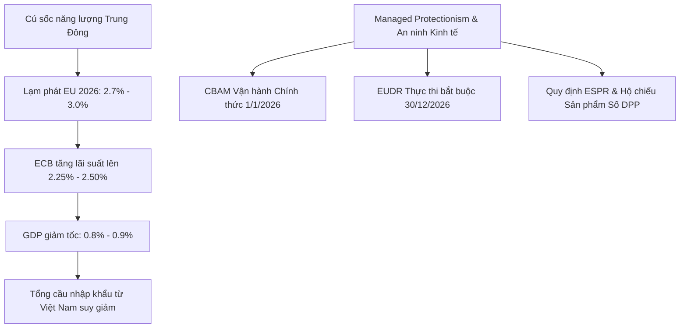
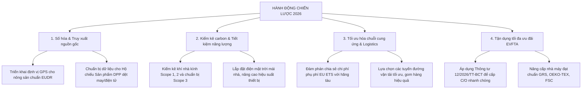

# BÁO CÁO PHÂN TÍCH KINH TẾ - CHÍNH TRỊ LIÊN MINH CHÂU ÂU (EU) NĂM 2026:
## TÁC ĐỘNG VÀ ĐỊNH HƯỚNG CHIẾN LƯỢC CHO DOANH NGHIỆP VIỆT NAM

*   **Tác giả:** Chuyên gia phân tích Kinh tế - Chính trị Quốc tế
*   **Thời gian lập báo cáo:** Ngày 29 tháng 05 năm 2026
*   **Đối tượng thụ hưởng:** Các cơ quan quản lý thương mại và Doanh nghiệp Việt Nam xuất khẩu sang thị trường EU

---

## 1. TÓM TẮT TỔNG QUAN KHU VỰC EU NĂM 2026

Năm 2026, nền kinh tế và chính trị của Liên minh Châu Âu (EU) đang ở trong trạng thái chuyển đổi phức tạp, được định hình bởi ba yếu tố cốt lõi: **Sự giảm tốc kinh tế dưới áp lực năng lượng**, **Sự thắt chặt tiền tệ phòng thủ của Ngân hàng Trung ương Châu Âu (ECB)**, và **Xu hướng dịch chuyển mạnh mẽ sang chính sách bảo hộ có kiểm soát (Managed Protectionism)** gắn liền với quá trình chuyển đổi xanh.



*   **Tăng trưởng GDP trì trệ:** Tăng trưởng kinh tế của Khu vực đồng Euro (Eurozone) năm 2026 bị hạ dự báo xuống mức rất thấp, chỉ đạt **0.8% - 0.9%** (so với các kỳ vọng phục hồi mạnh mẽ trước đó). Nguyên nhân chính xuất phát từ cú sốc giá năng lượng kéo dài do căng thẳng địa chính trị leo thang ở Trung Đông, kết hợp với các điều kiện tài chính thắt chặt làm suy giảm niềm tin của người tiêu dùng xuống mức thấp kỷ lục trong nhiều năm. Dự kiến nền kinh tế chỉ có thể phục hồi nhẹ lên mức 1.2% - 1.3% vào năm 2027 nếu các áp lực năng lượng hạ nhiệt.
*   **Lạm phát quay trở lại áp lực:** Sau giai đoạn hạ nhiệt tạm thời, lạm phát tại Eurozone đã tăng tốc trở lại trong nửa đầu năm 2026 do chi phí nhiên liệu và logistics tăng cao. Chỉ số lạm phát ước tính sơ bộ đạt **3.0%** vào tháng 4 năm 2026 và dự báo lạm phát trung bình cả năm 2026 sẽ dao động quanh mức **2.7% - 3.0%**.
*   **Chính sách tiền tệ phòng thủ của ECB:** Để đối phó với nguy cơ lạm phát cắm rễ sâu vào kỳ vọng tiền lương và giá cả, ECB đang duy trì quan điểm thắt chặt. Lãi suất tiền gửi (deposit facility rate) hiện tại ở mức **2.00%** (tính đến cuối tháng 5/2026). Tuy nhiên, thị trường đang định giá khả năng cực kỳ cao (92%) về một đợt tăng lãi suất thêm 25 điểm cơ bản tại cuộc họp ngày 10/06/2026, đưa lãi suất lên **2.25%**. Giới phân tích nhận định đây là các đợt "tăng lãi suất bảo hiểm" (insurance hikes) và dự báo sẽ có tổng cộng khoảng 2 đợt tăng trong năm 2026, đưa mức lãi suất trần lên **2.50%** trước khi dừng lại do nền kinh tế quá yếu và thị trường lao động có dấu hiệu lỏng lẻo.

---

## 2. CÁC XU HƯỚNG KINH TẾ - CHÍNH TRỊ NỔI BẬT NĂM 2026

### 2.1. CBAM chính thức bước vào Giai đoạn Thực thi (Definitive Phase)
Từ ngày **01/01/2026**, Cơ chế điều chỉnh biên giới carbon (CBAM) của EU đã chính thức kết thúc giai đoạn chuyển tiếp (2023 - 2025) và chuyển sang **giai đoạn thực thi hoàn toàn mang tính pháp lý và trách nhiệm tài chính**.
*   **Nghĩa vụ của nhà nhập khẩu:** Các nhà nhập khẩu bắt buộc phải đăng ký tư cách "Người khai báo CBAM được ủy quyền" (Authorized CBAM Declarant) để đưa hàng hóa thuộc phạm vi điều chỉnh (sắt thép, nhôm, xi măng, phân bón, hydro, điện) vào thị trường EU.
*   **Cơ chế tài chính:** Mặc dù lượng phát thải của hàng hóa nhập khẩu trong năm 2026 bắt đầu bị tính phí carbon, việc mua và nộp chứng chỉ CBAM đầu tiên sẽ không diễn ra ngay lập tức mà bắt đầu từ ngày **01/02/2027**, và hạn chót nộp tờ khai năm đầu tiên kèm theo chứng chỉ là ngày **30/09/2027**.
*   **Gói đơn giản hóa (Regulation (EU) 2025/2083):** Nhằm giảm bớt gánh nặng hành chính, EU áp dụng ngưỡng miễn trừ (de minimis) đối với các lô hàng có tổng khối lượng dưới **50 tấn/năm** (không áp dụng cho điện và hydro). Đồng thời, nghĩa vụ nắm giữ chứng chỉ CBAM hàng quý được giảm từ 80% xuống còn **50%** lượng phát thải dự kiến.
*   **Áp lực dữ liệu thực tế:** Việc sử dụng các giá trị phát thải mặc định (default values) sẽ chịu mức phạt tăng thêm (10% vào năm 2026, 20% vào năm 2027 và 30% từ năm 2028). Điều này buộc các nhà sản xuất xuất khẩu phải cung cấp dữ liệu phát thải thực tế được xác minh độc lập để tránh bị áp thuế phạt cao.

### 2.2. Hạn chót thực thi Quy định chống phá rừng (EUDR) cận kề
Sau các tranh cãi và trì hoãn trước đó, Ủy ban Châu Âu đã khẳng định sẽ không mở lại văn bản cốt lõi của EUDR để tránh bất ổn pháp lý.
*   **Mốc thời gian thực thi:** Luật sẽ chính thức có hiệu lực bắt buộc từ ngày **30/12/2026** đối với các doanh nghiệp lớn và vừa; và từ ngày **30/06/2027** đối với các doanh nghiệp nhỏ và siêu nhỏ (SMEs).
*   **Gói hỗ trợ đơn giản hóa (04/05/2026):** EU đã ban hành hướng dẫn thực thi mới giúp cắt giảm tới 75% gánh nặng hành chính cho doanh nghiệp. Đáng chú ý, hệ thống thông tin nộp cam kết thẩm định (Due Diligence Statements) sẽ được khởi động lại vào **tháng 6/2026**.
*   **Phạm vi sản phẩm:** Đang có dự thảo điều chỉnh bổ sung một số sản phẩm như cà phê hòa tan và các dẫn xuất dầu cọ, đồng thời xem xét **miễn trừ hoặc loại trừ đối với sản phẩm da thuộc (leather)** và lốp xe đắp lại. Đây là điểm cực kỳ quan trọng đối với ngành da giày Việt Nam.

### 2.3. Cải cách và đơn giản hóa CSRD & CSDDD (Gói cải cách Omnibus I)
Vào tháng 3 năm 2026, Chỉ thị (EU) 2026/470 (Omnibus I) có hiệu lực đã tái cấu trúc đáng kể lộ trình ESG của EU nhằm bảo vệ năng lực cạnh tranh của các doanh nghiệp nội khối trước chi phí tuân thủ quá lớn.
*   **CSRD (Chỉ thị báo cáo phát triển bền vững):** Ngưỡng áp dụng được nâng lên rất cao. Chỉ các doanh nghiệp có **trên 1,000 nhân viên** VÀ **doanh thu thuần trên 450 triệu EUR** mới bắt buộc phải báo cáo. Thay đổi này loại bỏ đến 80% - 90% số lượng công ty từng dự kiến thuộc phạm vi điều chỉnh ban đầu. Đặc biệt, EU áp dụng **"trần chuỗi giá trị" (value chain cap)** nhằm giới hạn thông tin mà các tập đoàn lớn có thể yêu cầu từ các đối tác nhỏ hơn ở nước ngoài (như Việt Nam). Lộ trình báo cáo của các nhóm doanh nghiệp tiếp theo cũng bị hoãn sang năm 2028 và 2029.
*   **CSDDD (Chỉ thị thẩm định tính bền vững):** Hạn chót để các quốc gia thành viên nội luật hóa được lùi đến ngày **26/07/2028** và thời gian áp dụng đồng loạt là ngày **26/07/2029**. Ngưỡng áp dụng được nâng lên mức cực lớn: các công ty có **trên 5,000 nhân viên** và doanh thu toàn cầu **trên 1.5 tỷ EUR**. Đồng thời, loại bỏ nghĩa vụ bắt buộc xây dựng kế hoạch chuyển đổi xanh và hệ thống trách nhiệm dân sự thống nhất cấp EU.

### 2.4. Quan hệ Việt Nam - EU nâng lên tầm cao mới
*   **Đối tác Chiến lược Toàn diện:** Việc Việt Nam và EU chính thức nâng cấp quan hệ lên **Đối tác Chiến lược Toàn diện** vào đầu năm 2026 là một dấu mốc lịch sử. Mối quan hệ này mở rộng hợp tác từ thương mại truyền thống sang các lĩnh vực công nghệ cao như chuỗi cung ứng bán dẫn, khai thác và chế biến khoáng sản thiết yếu, và chuyển đổi năng lượng xanh.
*   **EVFTA bước vào năm thứ 6:** Hơn **99% dòng thuế quan** đã được xóa bỏ hoàn toàn theo lộ trình. Trọng tâm của EVFTA trong năm 2026 đã dịch chuyển hoàn toàn từ cắt giảm thuế sang **giải quyết các rào cản phi thuế quan (TBT, SPS)** và thực thi các cam kết phát triển bền vững. Phía Việt Nam cũng đã ban hành Thông tư số 12/2026/TT-BCT nhằm đơn giản hóa tối đa quy trình cấp Chứng nhận xuất xứ (C/O) nhằm tận dụng tối đa ưu đãi từ Hiệp định.

---

## 3. PHÂN TÍCH CHI TIẾT RỦI RO ĐỐI VỚI DOANH NGHIỆP VIỆT NAM

Năm 2026 mang lại nhiều rủi ro mang tính hệ thống và trực tiếp đối với doanh nghiệp Việt Nam, tập trung vào ba nhóm ngành trọng điểm:

### 3.1. Nhóm ngành Xuất khẩu truyền thống (Dệt may, Da giày, Nông-lâm-thủy sản)

#### A. Nông - lâm - thủy sản (Mức độ rủi ro: Rất Cao)
*   **Hạn chót EUDR (30/12/2026):** Cà phê, cao su và gỗ là những mặt hàng chịu tác động trực tiếp và nghiêm trọng nhất. Doanh nghiệp Việt Nam phải chứng minh sản phẩm không được trồng trên đất có nguồn gốc phá rừng sau ngày 31/12/2020 bằng cách cung cấp tọa độ địa lý (GPS) chính xác của từng mảnh vườn. Đối với hàng triệu hộ nông dân nhỏ lẻ tại Tây Nguyên và các vùng nguyên liệu, việc thu thập dữ liệu GPS, số hóa bản đồ và thiết lập hệ thống truy xuất nguồn gốc trong vòng 7 tháng tới là một thách thức khổng lồ về mặt chi phí và công nghệ. Nếu không kịp hoàn thành trước hạn chót, hàng nông sản Việt Nam sẽ đối mặt với nguy cơ bị dừng thông quan tại cửa khẩu EU hoặc bị phạt tới 4% doanh thu hàng năm tại EU.
*   **Thẻ vàng IUU thủy sản chưa được gỡ:** Sau đợt thanh tra thứ 5 của EC vào tháng 3/2026, Việt Nam vẫn chưa thể gỡ bỏ "thẻ vàng" IUU. Mặc dù EC ghi nhận những tiến bộ lớn của Việt Nam trong quản lý đội tàu, kiểm soát cảng và triển khai hệ thống phần mềm truy xuất nguồn gốc điện tử (eCDT), nhưng các lỗ hổng về giám sát hành trình (VMS), tình trạng ngắt kết nối thiết bị định vị và việc kiểm soát chưa đồng bộ tại các cơ sở chế biến xuất khẩu khiến thẻ vàng tiếp tục bị duy trì. Hệ quả là 100% các lô hàng thủy sản xuất khẩu của Việt Nam sang EU tiếp tục bị kiểm tra thực tế tại cảng đến, gây chậm trễ từ 2 - 3 tuần, phát sinh chi phí lưu kho bãi cực lớn và làm giảm chất lượng hàng tươi sống.

```
[Thủy sản xuất khẩu Việt Nam] 
       │
       ▼ (Chưa gỡ thẻ vàng IUU trong đợt kiểm tra tháng 3/2026)
[Kiểm tra 100% tại cảng EU] 
       │
       ├─► Trễ thông quan 2-3 tuần
       ├─► Chi phí lưu kho bãi tăng vọt
       └─► Suy giảm chất lượng hàng tươi sống
```

#### B. Dệt may (Mức độ rủi ro: Cao)
*   **Lệnh cấm tiêu hủy hàng may mặc chưa bán (Destruction Ban):** Có hiệu lực từ ngày **19/07/2026** đối với các doanh nghiệp lớn. Quy định này gián tiếp buộc các thương hiệu thời trang EU phải thắt chặt đơn hàng, giảm lượng tồn kho và yêu cầu khắt khe hơn đối với nhà sản xuất về tính chính xác của số lượng sản phẩm.
*   **Tiêu chuẩn thiết kế sinh thái (ESPR) và Hộ chiếu sản phẩm số (DPP):** Hệ thống đăng ký DPP sẽ chạy từ tháng 7/2026. Các nhà mua hàng EU bắt đầu yêu cầu các nhà sản xuất dệt may Việt Nam phải cung cấp minh bạch thông tin nguyên liệu (tỷ lệ sợi tái chế, xuất xứ bông hữu cơ), quy trình nhuộm không hóa chất độc hại thông qua mã QR dán trên sản phẩm. Các doanh nghiệp chưa chuyển đổi số chuỗi cung ứng sẽ bị loại khỏi danh sách nhà cung cấp.

#### C. Da giày (Mức độ rủi ro: Trung bình - Cao)
*   Mặc dù da thuộc có cơ hội được loại trừ khỏi phạm vi EUDR (theo dự thảo tháng 5/2026), ngành da giày vẫn đối mặt với các tiêu chuẩn hóa chất nghiêm ngặt thuộc danh mục REACH sửa đổi năm 2026. Chi phí xét nghiệm lab, kiểm định hàm lượng kim loại nặng và các chất cấm tăng cao làm bào mòn biên lợi nhuận vốn đã mỏng của các doanh nghiệp gia công Việt Nam.

---

### 3.2. Nhóm ngành Điện tử & Bán dẫn (Mức độ rủi ro: Trung bình)

*   **Rủi ro từ các tiêu chuẩn RoHS và REACH ngặt nghèo hơn:** Các linh kiện điện tử xuất khẩu sang EU phải đáp ứng mức giới hạn cực thấp đối với các chất độc hại (như chì, cadmium, phthalates). Trong năm 2026, EU bổ sung thêm một số hợp chất halogen vào danh mục hạn chế, gây khó khăn cho việc tìm kiếm vật liệu thay thế trong sản xuất bo mạch và vỏ nhựa linh kiện. Việc Việt Nam ban hành Thông tư số 01/2026/TT-BCT để nội địa hóa tiêu chuẩn RoHS là bước đi cần thiết nhưng đòi hỏi doanh nghiệp phải đầu tư lớn vào các phòng thí nghiệm kiểm chuẩn trong nước.
*   **Yêu cầu gián tiếp từ CSDDD và CSRD thông qua chuỗi cung ứng:** Dù CSDDD và CSRD đã được nới lỏng ngưỡng áp dụng trực tiếp cho các doanh nghiệp quy mô cực lớn, các tập đoàn đa quốc gia về điện tử của EU (như Philips, Siemens, STMicroelectronics) vẫn bắt buộc phải báo cáo về dấu chân carbon và tính bền vững của toàn bộ chuỗi cung ứng của họ. Do đó, họ áp đặt các tiêu chuẩn xanh này (yêu cầu báo cáo Scope 1, Scope 2 và chuẩn bị cho Scope 3, sử dụng 100% năng lượng tái tạo) lên các nhà máy sản xuất linh kiện vệ tinh tại Việt Nam thông qua các điều khoản hợp đồng thương mại bắt buộc. Doanh nghiệp Việt Nam nếu không có lộ trình trung hòa carbon sẽ mất các hợp đồng B2B giá trị cao này.

---

### 3.3. Nhóm ngành Logistics & Chuỗi cung ứng (Mức độ rủi ro: Rất Cao)

Đây là nhóm ngành chịu tác động kép trực tiếp nhất từ chính sách khí hậu của EU và khủng hỏang địa chính trị toàn cầu:

*   **EU ETS hàng hải áp dụng 100% từ 01/01/2026:** Khác với mức 70% của năm 2025, từ đầu năm 2026, các hãng tàu phải nộp hạn ngạch phát thải cho **100% lượng khí thải** trên các chặng nội khối EU và **50% lượng khí thải** trên các chặng đi/đến EU (bao gồm tuyến Việt Nam - EU). Đặc biệt, hệ thống đã mở rộng để tính phí cả khí Mê-tan (CH4) và Nitơ oxit (N2O).
*   **Chi phí phụ phí carbon tăng vọt:** Các hãng tàu lớn (như Maersk, MSC, CMA CGM) đã đồng loạt chuyển giao 100% chi phí mua chứng chỉ carbon này sang cho chủ hàng Việt Nam dưới dạng phụ phí "EU ETS Surcharge". Mức phụ phí này biến động mạnh theo giá thị trường hạn ngạch phát thải của EU (EUA), hiện đang dao động ở mức cao.
*   **Tác động cộng hưởng từ khủng hoảng Biển Đỏ kéo dài:** Do căng thẳng Biển Đỏ tiếp diễn trong năm 2026, hầu hết các tàu container từ Việt Nam sang EU phải đi vòng qua Mũi Hảo Vọng. Hành trình này kéo dài thời gian thêm 10 - 15 ngày và quãng đường dài hơn làm **lượng tiêu thụ nhiên liệu tăng thêm từ 30% - 40%**. Do lượng phát thải thực tế tăng vọt, **phụ phí carbon EU ETS bị nhân lên tương ứng**, đẩy tổng chi phí logistics từ Việt Nam sang các cảng lớn của châu Âu (Rotterdam, Hamburg, Antwerp) lên mức kỷ lục mới, làm giảm nghiêm trọng tính cạnh tranh về giá của hàng hóa Việt Nam so với các đối thủ gần EU hơn (như Thổ Nhĩ Kỳ, Morocco).

```
Khủng hoảng Biển Đỏ (Đi vòng Mũi Hảo Vọng) 
       ▼
Quãng đường tăng 30% - 40% 
       ▼
Tiêu thụ nhiên liệu tăng vọt ──► Lượng phát thải CO2, CH4, N2O tăng mạnh
                                           │
                                           ▼
                            [Phụ phí EU ETS 100% nhân lên gấp bội]
                                           │
                                           ▼
                            [Chi phí Logistics sang EU đạt đỉnh kỷ lục]
```

---

## 4. PHÂN TÍCH CHI TIẾT CƠ HỘI ĐỐI VỚI DOANH NGHIỆP VIỆT NAM

Bên cạnh những thách thức nghiêm trọng, bối cảnh kinh tế - chính trị EU năm 2026 cũng mở ra những cơ hội chiến lược mang tính bước ngoặt cho các doanh nghiệp Việt Nam chủ động thích ứng:

### 4.1. Lợi thế từ mối quan hệ Đối tác Chiến lược Toàn diện và EVFTA
*   **Ưu đãi thuế quan vượt trội:** Bước sang năm thứ 6 của EVFTA, lợi thế thuế quan của Việt Nam so với các quốc gia cạnh tranh trực tiếp tại Đông Nam Á (chưa có FTA với EU như Thái Lan, Indonesia, Philippines) đạt mức tối đa khi hầu hết các dòng thuế tiêu dùng đã về 0%. Đây là bệ đỡ cực kỳ vững chắc giúp bù đắp một phần chi phí logistics gia tăng do khủng hoảng Biển Đỏ và phí carbon hàng hải.
*   **Cơ hội thu hút dòng vốn đầu tư dịch chuyển:** Việc nâng cấp quan hệ ngoại giao lên Đối tác Chiến lược Toàn diện vào đầu năm 2026 giúp Việt Nam trở thành điểm đến ưu tiên của dòng vốn FDI chất lượng cao từ EU. Các tập đoàn công nghệ lớn của EU đang tìm kiếm cơ hội hợp tác thiết lập các trung tâm nghiên cứu và sản xuất bán dẫn, khai thác khoáng sản bán dẫn (đất hiếm) và phát triển hạ tầng năng lượng tái tạo (điện gió ngoài khơi) tại Việt Nam để đa dạng hóa chuỗi cung ứng ngoài Trung Quốc.

### 4.2. Lợi thế từ gói cải cách nới lỏng quy định của EU (Omnibus I)
*   **Giảm áp lực tuân thủ ngắn hạn cho các SMEs:** Việc EU nâng mạnh ngưỡng áp dụng của CSRD (doanh thu >450 triệu EUR) và CSDDD (doanh thu >1.5 tỷ EUR), đồng thời áp dụng "trần chuỗi giá trị" (value chain cap) là một **"khoảng thở" vô cùng quý giá** cho các doanh nghiệp vừa và nhỏ của Việt Nam. Doanh nghiệp Việt Nam sẽ không bị các đối tác EU đòi hỏi cung cấp các bộ dữ liệu ESG quá tải vượt ngoài khả năng tài chính và kỹ thuật trong giai đoạn 2026 - 2027. Điều này giúp các doanh nghiệp có thêm thời gian để chuẩn bị nguồn lực, chuẩn hóa quy trình báo cáo một cách tự nguyện và có lộ trình.

### 4.3. Cơ hội từ việc đi đầu trong chuyển dịch xanh (Green First-mover Advantage)
*   **Chiếm lĩnh phân khúc thị trường cao cấp:** Người tiêu dùng châu Âu ngày càng có xu hướng ưu tiên các sản phẩm dán nhãn sinh thái, có nguồn gốc rõ ràng và bền vững. Những doanh nghiệp Việt Nam chủ động đạt các chứng chỉ xanh quốc tế như GRS (Global Recycled Standard), OEKO-TEX cho dệt may; FSC cho ngành gỗ; hay sản xuất nông nghiệp hữu cơ đạt chuẩn EUDR sớm sẽ trở thành **nhà cung cấp ưu tiên hàng đầu** của các nhà mua hàng lớn tại EU. Đây là cơ hội để chuyển đổi từ mô hình cạnh tranh bằng giá thấp (low-cost) sang cạnh tranh bằng giá trị bền vững (sustainable value), giúp nâng cao biên lợi nhuận.
*   **Quy tắc xuất xứ EVFTA thúc đẩy tự chủ chuỗi cung ứng:** Quy tắc xuất xứ "Từ vải trở đi" (Fabric Forward) của EVFTA tiếp tục khuyến khích các doanh nghiệp dệt may đầu tư sâu vào khâu thượng nguồn (dệt, nhuộm) tại Việt Nam hoặc sử dụng vải từ các nước có FTA với EU (như Hàn Quốc). Điều này đẩy nhanh quá trình tự chủ hóa nguồn nguyên liệu trong nước, giảm phụ thuộc vào các nguồn cung từ các nước thứ ba vốn đang bị EU giám sát chặt chẽ về mặt xuất xứ và tiêu chuẩn lao động.

---

## 5. ĐÁNH GIÁ MỨC ĐỘ TÁC ĐỘNG CHUNG VÀ KHUYẾN NGHỊ CHIẾN LƯỢC

### 5.1. Đánh giá mức độ tác động chung: **CAO (HIGH IMPACT)**

Mặc dù EU đã có những bước lùi chiến thuật bằng việc đơn giản hóa các chỉ thị ESG lớn (như CSRD, CSDDD qua gói Omnibus I) và xem xét giảm bớt phạm vi EUDR cho ngành da giày, tác động chung đối với doanh nghiệp Việt Nam trong năm 2026 vẫn ở mức **Cao**.

```
    MỨC ĐỘ TÁC ĐỘNG CHUNG NĂM 2026: CAO (HIGH)
┌─────────────────────────────────────────────────────────────┐
│ 1. CBAM bước vào Definitive Phase (Trách nhiệm tài chính)   │
│ 2. EUDR chính thức thực thi từ 30/12/2026 (Nông nghiệp)     │
│ 3. EU ETS hàng hải áp dụng 100% + Khủng hoảng Biển Đỏ       │
│ 4. Kinh tế EU trì trệ (GDP 0.8% - 0.9%), ECB thắt chặt      │
└─────────────────────────────────────────────────────────────┘
```

**Lý do đánh giá:**
1.  **Tính bắt buộc pháp lý:** Năm 2026 là cột mốc bắt đầu thực thi bắt buộc của các quy định môi trường cực kỳ khắt khe: CBAM Definitive Phase (01/01/2026), Lệnh cấm hủy hàng may mặc chưa bán (19/07/2026), và hạn chót thực thi EUDR (30/12/2026). Đây không còn là các khuyến nghị tự nguyện mà là luật định bắt buộc tại biên giới EU.
2.  **Tác động kép của Logistics:** Chi phí vận chuyển hàng sang EU tăng vọt do phụ phí carbon EU ETS (áp dụng 100% từ 2026) cộng hưởng với quãng đường kéo dài qua Mũi Hảo Vọng do căng thẳng Biển Đỏ. Điều này triệt tiêu đáng kể lợi thế về giá của hàng hóa Việt Nam.
3.  **Cầu tiêu dùng suy yếu:** Tình trạng kinh tế EU tăng trưởng chậm chạp (0.8% - 0.9%), lạm phát dai dẳng (2.7% - 3.0%) và chính sách duy trì lãi suất cao của ECB sẽ trực tiếp bóp nghẹt tổng cầu tiêu dùng đối với các sản phẩm nhập khẩu không thiết yếu từ Việt Nam.

---

### 5.2. Khuyến nghị chiến lược cho Doanh nghiệp Việt Nam

Để tồn tại và bứt phá trong bối cảnh nhiều biến động của thị trường EU năm 2026, doanh nghiệp Việt Nam cần nhanh chóng triển khai các hành động sau:



#### 1. Đẩy nhanh tiến trình số hóa và truy xuất nguồn gốc
*   **Đối với ngành nông sản:** Các doanh nghiệp xuất khẩu cà phê, gỗ, cao su phải phối hợp chặt chẽ với chính quyền địa phương và các hợp tác xã nông nghiệp để hoàn thành việc đo đạc, lập bản đồ số hóa tọa độ GPS cho các vùng trồng nguyên liệu trước thời hạn 30/12/2026. Tận dụng gói công cụ đơn giản hóa của EU để đăng ký tài khoản trên Hệ thống Thông tin EUDR trong tháng 6/2026.
*   **Đối với ngành dệt may và điện tử:** Bắt đầu xây dựng cơ sở dữ liệu vật liệu, chứng nhận quy trình nhuộm/sản xuất thân thiện môi trường để sẵn sàng tích hợp vào hệ thống Hộ chiếu sản phẩm kỹ thuật số (DPP) của EU.

#### 2. Kiểm kê khí nhà kính và chuyển đổi công nghệ carbon thấp
*   **Kiểm kê carbon:** Doanh nghiệp cần chủ động thực hiện kiểm kê khí nhà kính (Scope 1, Scope 2 và chuẩn bị lộ trình cho Scope 3). Đây là tấm vé bắt buộc để duy trì quan hệ đối tác B2B với các tập đoàn lớn của EU đang phải tuân thủ CSRD/CSDDD.
*   **Đầu tư công nghệ sạch:** Từng bước chuyển đổi sang sử dụng năng lượng tái tạo (như lắp đặt điện mặt trời mái nhà tự sản tự tiêu), cải tiến hiệu suất năng lượng của máy móc thiết bị nhằm giảm thiểu lượng carbon dấu chân (carbon footprint) trong sản phẩm, hướng tới việc giảm thiểu thuế CBAM trong tương lai.

#### 3. Tối ưu hóa logistics và đàm phán hợp đồng vận chuyển
*   **Quản trị chi phí phụ phí EU ETS:** Doanh nghiệp cần yêu cầu các đơn vị logistics cung cấp bảng tính phụ phí carbon chi tiết, minh bạch theo từng hãng tàu. Cân nhắc ký hợp đồng dài hạn với các hãng tàu sở hữu đội tàu hiện đại, sử dụng nhiên liệu sinh học hoặc công nghệ tiết kiệm năng lượng để giảm thiểu phụ phí carbon.
*   **Gom hàng và tối ưu hóa tuyến đường:** Tăng cường liên kết giữa các nhà xuất khẩu để gom hàng, tối ưu hóa container, giảm thiểu các chặng vận chuyển trung gian không cần thiết nhằm tiết giảm lượng phát thải thực tế.

#### 4. Tận dụng tối đa hỗ trợ thể chế và nâng cấp chứng nhận
*   **Tận dụng hỗ trợ hành chính:** Áp dụng triệt để các quy trình đơn giản hóa thủ tục hành chính, đặc biệt là Thông tư số 12/2026/TT-BCT về cấp C/O tự động để rút ngắn thời gian chuẩn bị hồ sơ xuất khẩu dưới ưu đãi EVFTA.
*   **Nâng cấp nhà máy:** Chủ động đầu tư nâng cấp các nhà máy sản xuất đạt các tiêu chuẩn xanh uy tín được EU thừa nhận rộng rãi như GRS, OEKO-TEX, FSC để tạo lợi thế cạnh tranh tuyệt đối trước các đối thủ cạnh tranh truyền thống.

---
**Bản quyền Báo cáo:** *Tài liệu thuộc chương trình nghiên cứu kinh tế quốc tế của doanh nghiệp Việt Nam. Nghiêm cấm sao chép dưới mọi hình thức thương mại khi chưa được sự đồng ý của tác giả.*
