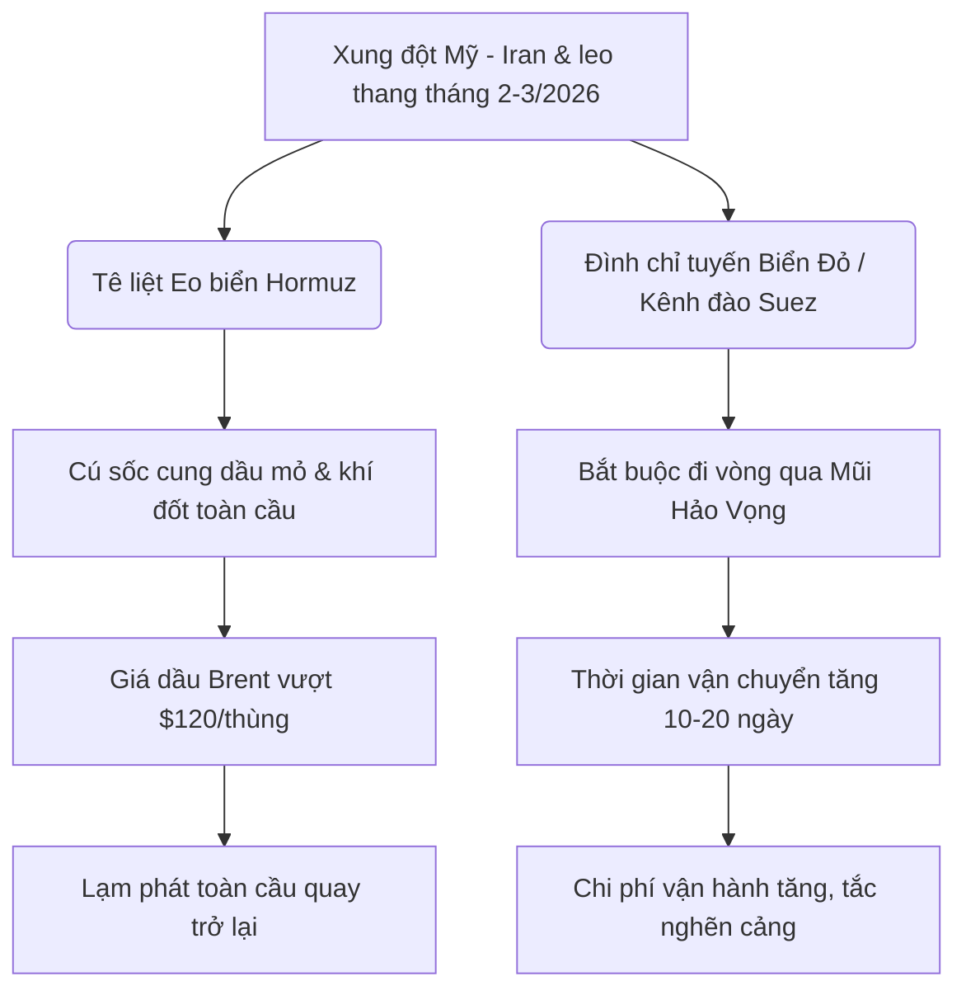

# BÁO CÁO PHÂN TÍCH KINH TẾ - CHÍNH TRỊ TRUNG ĐÔNG NĂM 2026
## TÁC ĐỘNG CHIẾN LƯỢC VÀ KHUYẾN NGHỊ CHO DOANH NGHIỆP VIỆT NAM

*   **Tác giả:** Chuyên gia Phân tích Kinh tế - Chính trị Quốc tế (Antigravity)
*   **Thời gian thực hiện:** Ngày 29 tháng 05 năm 2026
*   **Bản quyền:** Phòng Nghiên cứu Chiến lược Quốc tế - Hệ thống Phân tích Đầu tư Toàn cầu

---

### MỤC LỤC
1. [Tóm tắt tổng quan khu vực Trung Đông năm 2026](#1-tóm-tắt-tổng-quan-khu-vực-trung-đông-năm-2026)
2. [Các xu hướng kinh tế - chính trị nổi bật năm 2026](#2-các-xu-hướng-kinh-tế---chính-trị-nổi-bật-năm-2026)
   - [2.1. Điểm nóng địa chính trị và eo biển Hormuz / Biển Đỏ](#21-điểm-nóng-địa-chính-trị-và-eo-biển-hormuz--biển-đỏ)
   - [2.2. Khủng hoảng Logistics và tuyến vận tải qua Mũi Hảo Vọng](#22-khủng-hoảng-logistics-và-tuyến-vận-tải-qua-mũi-hảo-vọng)
   - [2.3. Thị trường năng lượng, giá dầu thô và lạm phát toàn cầu](#23-thị-trường-năng-lượng-giá-dầu-thô-và-lạm-phát-toàn-cầu)
3. [Phân tích chi tiết rủi ro đối với Doanh nghiệp Việt Nam](#3-phân-tích-chi-tiết-rủi-ro-đối-với-doanh-nghiệp-việt-nam)
   - [3.1. Nhóm ngành Xuất khẩu (Nông-Lâm-Thủy sản & Dệt may)](#31-nhóm-ngành-xuất-khẩu-nông-lâm-thủy-sản--dệt-may)
   - [3.2. Nhóm ngành Điện tử & Bán dẫn](#32-nhóm-ngành-điện-tử--bán-dẫn)
   - [3.3. Nhóm ngành Logistics & Chuỗi cung ứng](#33-nhóm-ngành-logistics--chuỗi-cung-ứng)
4. [Phân tích chi tiết cơ hội đối với Doanh nghiệp Việt Nam](#4-phân-tích-chi-tiết-cơ-hội-đối-với-doanh-nghiệp-việt-nam)
   - [4.1. Hiệp định CEPA Việt Nam - UAE và Thị trường Halal khổng lồ](#41-hiệp-định-cepa-việt-nam---uae-và-thị-trường-halal-khổng-lồ)
   - [4.2. Dịch chuyển làn sóng đầu tư FDI (Chiến lược "China + 1")](#42-dịch-chuyển-làn-sóng-đầu-tư-fdi-chiến-lược-china--1)
   - [4.3. Phát triển phương thức Logistics đa phương thức và bền vững](#43-phát-triển-phương-thức-logistics-đa-phương-thức-và-bền-vững)
5. [Đánh giá mức độ tác động chung và Khuyến nghị chiến lược](#5-đánh-giá-mức-độ-tác-động-chung-và-khuyến-nghị-chiến-lược)
   - [5.1. Đánh giá mức độ tác động chung (Thấp, Trung bình, Cao)](#51-đánh-giá-mức-độ-tác-động-chung)
   - [5.2. Khuyến nghị chiến lược dành cho doanh nghiệp Việt Nam](#52-khuyến-nghị-chiến-lược-dành-cho-doanh-nghiệp-việt-nam)

---

## 1. TÓM TẮT TỔNG QUAN KHU VỰC TRUNG ĐÔNG NĂM 2026

Năm 2026 ghi nhận một giai đoạn biến động địa chính trị dữ dội nhất trong nhiều thập kỷ qua tại khu vực Trung Đông. Căng thẳng leo thang đỉnh điểm vào **cuối tháng 2 năm 2026** với cuộc xung đột trực tiếp giữa Hoa Kỳ, Israel và Iran, biến toàn bộ khu vực thành một "thùng thuốc súng" quốc tế thực sự. Sự kiện này đã đảo ngược hoàn toàn những tín hiệu hạ nhiệt ngắn ngủi đạt được vào cuối năm 2025. 

Tâm điểm của cuộc khủng hoảng năm 2026 là sự tắc nghẽn nghiêm trọng và gần như hoàn toàn tại **Eo biển Hormuz** – yết hầu năng lượng của thế giới – cùng với việc tái bùng phát các cuộc tấn công vũ trang ở **Biển Đỏ và Kênh đào Suez**. Việc di chuyển qua các eo biển này trở nên cực kỳ nguy hiểm, buộc ngành vận tải biển toàn cầu phải tái cấu trúc toàn diện, biến tuyến đường đi vòng qua **Mũi Hảo Vọng (Nam Phi)** từ một giải pháp tình thế trở thành **"Trạng thái bình thường mới" (New Normal)**.

Về kinh tế, sự gián đoạn này đã kích hoạt một cú sốc cung dầu mỏ lớn, đẩy giá dầu Brent vượt ngưỡng $120/thùng và đe dọa các kịch bản lạm phát toàn cầu. Đối với Việt Nam – một nền kinh tế có độ mở lớn và hội nhập sâu rộng, những chuyển dịch địa chính trị tại Trung Đông trong năm 2026 không chỉ mang đến các thách thức mang tính sống còn về chi phí vận hành và chuỗi cung ứng, mà còn mở ra những cơ hội mang tính bước ngoặt lịch sử nhờ vào các hiệp định thương mại thế hệ mới và làn sóng tái định vị chuỗi sản xuất toàn cầu.

---

## 2. CÁC XU HƯỚNG KINH TẾ - CHÍNH TRỊ NỔI BẬT NĂM 2026

### 2.1. Điểm nóng địa chính trị và eo biển Hormuz / Biển Đỏ
Tình hình an ninh hàng hải tại Trung Đông năm 2026 được định hình bởi hai cuộc khủng hoảng song hành:

*   **Phong tỏa Eo biển Hormuz:** Kể từ cuối tháng 2/2026, sau khi xung đột Mỹ - Iran bùng phát, eo biển Hormuz đã rơi vào trạng thái tê liệt nghiêm trọng. Iran áp đặt các hạn chế nghiêm ngặt và tiến hành bắt giữ, tấn công các tàu thương mại bị cáo buộc liên kết với phương Tây. Đáp lại, liên quân do Mỹ dẫn đầu thiết lập vòng phong tỏa các cảng biển của Iran. Tình trạng "phong tỏa kép" này khiến khoảng **15% - 20% lượng dầu mỏ và khí hóa lỏng (LNG) lưu thông bằng đường biển của thế giới bị kẹt cứng**, cắt đứt tuyến hàng hải huyết mạch kết nối vùng Vịnh với thế giới.
*   **Đóng băng Kênh đào Suez & Biển Đỏ:** Sau một thời gian tạm lắng ngắn hạn cuối năm 2025 nhờ nỗ lực ngừng bắn sơ bộ, làn sóng leo thang quân sự vào tháng 3/2026 đã dập tắt mọi hy vọng khôi phục tuyến đường qua Kênh đào Suez. Các hãng tàu lớn như Maersk, MSC, Hapag-Lloyd sau khi thử nghiệm quay lại Suez vào đầu năm 2026 đã phải **tuyên bố đình chỉ vô thời hạn** kế hoạch này do rủi ro an ninh quá cao.



### 2.2. Khủng hoảng Logistics và tuyến vận tải qua Mũi Hảo Vọng
Tuyến đi vòng qua **Mũi Hảo Vọng (Cape of Good Hope)** đi qua cực nam châu Phi đã chính thức trở thành tuyến đường vận tải chủ đạo nối Á - Âu và bờ Đông nước Mỹ trong năm 2026. Sự thay đổi mang tính cấu trúc này kéo theo các hệ lụy nặng nề:
*   **Kéo dài thời gian hải trình:** Cộng thêm **10 đến 20 ngày** hành trình cho mỗi lượt đi và về so với tuyến qua Suez.
*   **Phát sinh chi phí khổng lồ:** Mỗi chuyến đi vòng tiêu tốn thêm khoảng **1 triệu USD** chi phí nhiên liệu (do quãng đường tăng 30% - 40%), chưa kể phí hao mòn kỹ thuật và chi phí nhân công tăng thêm.
*   **Hiệu ứng domino lên chuỗi cung ứng:** Thời gian quay vòng tàu lâu hơn làm giảm công suất vận tải thực tế toàn cầu từ 10% - 15%, dẫn đến tình trạng thiếu hụt vỏ container rỗng cục bộ tại các đầu cảng xuất khẩu lớn ở châu Á (trong đó có Việt Nam) và làm giảm độ tin cậy của lịch trình tàu xuống dưới **50%**.

### 2.3. Thị trường năng lượng, giá dầu thô và lạm phát toàn cầu
Cú sốc phong tỏa eo biển Hormuz đã châm ngòi cho đợt tăng giá năng lượng khốc liệt nhất kể từ năm 2022:
*   **Biến động giá dầu:** Giá dầu thô Brent trung bình trong nửa đầu năm 2026 neo ở mức cao, thường xuyên **vượt mốc $120/thùng**. Trong các kịch bản cực đoan nếu xung đột tiếp tục kéo dài không có lối thoát, Ngân hàng Thế giới (World Bank) cảnh báo giá dầu hoàn toàn có thể chạm ngưỡng **$180/thùng**.
*   **Giá năng lượng tăng vọt:** Chi phí năng lượng toàn cầu ước tính tăng **24%** trong năm 2026, gián tiếp đẩy giá của các mặt hàng thiết yếu như phân bón (sử dụng khí gas đầu vào) và hóa chất tăng theo.
*   **Lạm phát quay trở lại:** Xu hướng giảm lạm phát (disinflation) toàn cầu duy trì từ 2023 - 2025 đã bị chặn đứng. Lạm phát lõi tại EU và các nước nhập khẩu ròng dầu mỏ bị kích hoạt tăng trở lại, đặt các Ngân hàng Trung ương (đặc biệt là Fed và ECB) vào thế tiến thoái lưỡng nan: vừa phải cân nhắc tăng/giữ lãi suất cao để kìm hãm lạm phát, vừa lo sợ đẩy nền kinh tế vào suy thoái.

---

## 3. PHÂN TÍCH CHI TIẾT RỦI RO ĐỐI VỚI DOANH NGHIỆP VIỆT NAM

Việt Nam, với tư cách là quốc gia xuất khẩu lớn và nhập khẩu ròng nhiều nguyên liệu đầu vào, đang chịu tác động trực tiếp mạnh mẽ từ cuộc khủng hoảng này trên 3 nhóm ngành trọng điểm:

### 3.1. Nhóm ngành Xuất khẩu (Nông-Lâm-Thủy sản & Dệt may)
Thị trường Mỹ và EU là hai đối tác xuất khẩu chủ lực của Việt Nam đối với các mặt hàng nông-lâm-thủy sản (thủy sản đông lạnh, đồ gỗ, hạt tiêu, cà phê...) và dệt may/da giày. Rủi ro chính bao gồm:
*   **Cước tàu biển leo thang và phụ phí dày đặc:** Việc đi vòng qua Mũi Hảo Vọng buộc các hãng tàu áp thêm hàng loạt phụ phí như Phụ phí mùa cao điểm (PSS), Phụ phí gián đoạn tuyến đường (TDS), và Phụ phí nhiên liệu (BAF). Các doanh nghiệp xuất khẩu theo điều kiện FOB chịu áp lực gián tiếp từ việc khách hàng nước ngoài ép giá mua, còn doanh nghiệp xuất khẩu CIF trực tiếp gánh chịu chi phí vận chuyển tăng gấp 2 - 3 lần so với trước khủng hoảng.
*   **Thời gian giao hàng kéo dài gây hư hỏng hàng hóa:** Đối với nhóm nông - thủy sản tươi sống hoặc đông lạnh, việc kéo dài thêm 10 - 20 ngày trên biển làm tăng tỷ lệ hao hụt, hư hỏng và đẩy chi phí cắm điện bảo ôn (reefer container) tăng vọt.
*   **Rủi ro từ các quy định carbon mới của EU:** Kể từ năm 2026, các quy định nghiêm ngặt như **Cơ chế điều chỉnh biên giới carbon (CBAM)** và **Hệ thống giao dịch khí thải của EU (EU ETS)** áp dụng cho ngành hàng hải sẽ tính phí dựa trên quãng đường vận chuyển. Việc tàu phải đi vòng xa hơn qua Mũi Hảo Vọng trực tiếp làm tăng lượng khí thải phát thải, khiến hàng hóa Việt Nam bị đánh thuế carbon cao hơn khi cập cảng châu Âu, làm suy giảm nghiêm trọng năng lực cạnh tranh trước các đối thủ ở gần châu Âu (như Thổ Nhĩ Kỳ hay Bắc Phi).
*   **Áp lực dòng tiền và vốn lưu động:** Thời gian vận chuyển kéo dài đồng nghĩa với việc chu kỳ thu hồi công nợ bị chậm lại từ 15 - 30 ngày, gây thâm hụt dòng tiền hoạt động của các doanh nghiệp vừa và nhỏ (SMEs).

### 3.2. Nhóm ngành Điện tử & Bán dẫn
Ngành công nghiệp điện tử và bán dẫn Việt Nam (chiếm hơn 30% tổng kim ngạch xuất khẩu của cả nước) phụ thuộc rất lớn vào mô hình sản xuất liên kết toàn cầu và giao hàng đúng hạn (Just-in-Time). Rủi ro cụ thể gồm:
*   **Đứt gãy chuỗi cung ứng linh kiện nhập khẩu:** Việt Nam phải nhập khẩu đến **80% giá trị linh kiện** cấu thành điện thoại và thiết bị điện tử. Các chuyến tàu chở linh kiện bán dẫn, IC và bảng mạch từ châu Âu/Mỹ về Việt Nam hoặc từ Việt Nam đi xuất khẩu bị chậm trễ khiến tiến độ lắp ráp tại các khu công nghiệp trọng điểm bị đình trệ.
*   **Áp lực chi phí logistics hàng không tăng cao:** Để bảo đảm tiến độ giao hàng cho các dòng sản phẩm cao cấp (như điện thoại thông minh, chip bán dẫn thế hệ mới), doanh nghiệp buộc phải chuyển từ đường biển sang đường hàng không (Air Freight). Tuy nhiên, cước hàng không cũng tăng phi mã do nhu cầu dồn ứ, trực tiếp bào mòn biên lợi nhuận vốn đã mỏng của khâu gia công lắp ráp bán dẫn.
*   **Rủi ro trễ hẹn đơn hàng (Lead Time):** Sự thiếu ổn định của lịch trình vận tải biển làm sai lệch kế hoạch sản xuất, dẫn đến nguy cơ bị đối tác phạt hợp đồng hoặc mất đơn hàng vào tay các đối thủ cạnh tranh có chuỗi cung ứng nội địa hóa tốt hơn.

### 3.3. Nhóm ngành Logistics & Chuỗi cung ứng
Ngành logistics Việt Nam tuy tăng trưởng nhanh nhưng còn phân mảnh, chủ yếu làm đại lý cấp 2, cấp 3 cho các hãng tàu ngoại. Rủi ro bao gồm:
*   **Thiếu hụt container rỗng nghiêm trọng:** Do tàu phải đi quãng đường dài hơn, lượng vỏ container bị giữ lại trên biển lâu hơn, tạo ra sự phân bổ lệch pha. Các cảng lớn như Cát Lái, Cái Mép - Thị Vải liên tục đối mặt với tình trạng thiếu hụt vỏ container loại GP và Reefer để đóng hàng xuất khẩu.
*   **Áp lực ép giá từ các hãng tàu nước ngoài:** Do các hãng tàu lớn (đóng vai trò liên minh hàng hải quốc tế) nắm quyền định đoạt giá cước và phân bổ chỗ trên tàu (space allocation), các doanh nghiệp logistics nội địa của Việt Nam gặp cực kỳ nhiều khó khăn trong việc đàm phán giữ chỗ cho khách hàng xuất khẩu trong nước.
*   **Tắc nghẽn cảng trung chuyển:** Việc thay đổi lịch trình khiến các tàu dồn ứ cùng lúc tại các cảng trung chuyển lớn trong khu vực như Singapore, Klang (Malaysia) gây ra hiện tượng nghẽn mạng lưới giao nhận toàn cục, kéo dài thêm thời gian chờ đợi của hàng hóa từ Việt Nam.

---

## 4. PHÂN TÍCH CHI TIẾT CƠ HỘI ĐỐI VỚI DOANH NGHIỆP VIỆT NAM

Bên cạnh những thách thức mang tính thế giới, bối cảnh Trung Đông 2026 cũng mở ra những cánh cửa cơ hội vô cùng lớn cho các doanh nghiệp Việt Nam biết chủ động chuyển mình và khai thác các lợi thế chiến lược:

```
+-----------------------------------------------------------------------------------+
|               DANH MỤC CƠ HỘI CHIẾN LƯỢC CHO DN VIỆT NAM NĂM 2026                 |
+------------------------------------+----------------------------------------------+
| Cơ hội 1: CEPA & Thị trường Halal  | Thuế quan 0% vào UAE, thâm nhập vùng Vịnh,   |
|                                    | chuẩn hóa chất lượng xuất khẩu theo NĐ 127.  |
+------------------------------------+----------------------------------------------+
| Cơ hội 2: Dịch chuyển dòng vốn FDI| Thu hút làn sóng bán dẫn & công nghệ cao nhờ |
|                                    | môi trường chính trị ổn định (Bac Ninh/HP).  |
+------------------------------------+----------------------------------------------+
| Cơ hội 3: Chuyển đổi Logistics xanh | Sử dụng đường sắt Á-Âu, vận tải đa phương    |
|                                    | thức Air-Sea, nâng cấp chuỗi cung ứng số.    |
+------------------------------------+----------------------------------------------+
```

### 4.1. Hiệp định CEPA Việt Nam - UAE và Thị trường Halal khổng lồ
*   **Cú hích thuế quan từ Hiệp định CEPA:** Hiệp định Đối tác Kinh tế Toàn diện (CEPA) giữa Việt Nam và Các Tiểu vương quốc Ả Rập Thống nhất (UAE) chính thức có hiệu lực từ **tháng 2 năm 2026** là một bước ngoặt lịch sử. UAE cam kết xóa bỏ thuế quan lên đến **99%** dòng thuế đối với hàng hóa Việt Nam. Điều này biến UAE thành một "cửa ngõ vàng" để hàng xuất khẩu Việt Nam thâm nhập trực tiếp vào toàn bộ khu vực Hội đồng Hợp tác Vùng Vịnh (GCC) mà không phải chịu các mức thuế quan cao thông thường.
*   **Bùng nổ nhu cầu lương thực tại Trung Đông:** Các quốc gia vùng Vịnh phải nhập khẩu tới **85% - 90% nhu cầu lương thực**. Việc gián đoạn nguồn cung địa phương và quốc tế càng làm tăng nhu cầu tích trữ lương thực an toàn tại các nước này. Việt Nam có cơ hội cực kỳ lớn để xuất khẩu gạo, thủy sản (tôm, cá tra), nông sản chế biến, trái cây sấy sang thị trường này với giá trị cao.
*   **Chuẩn hóa hệ sinh thái Halal nhờ Nghị định 127/2026/ND-CP:** Được ban hành vào tháng 4 năm 2026, Nghị định này tạo ra khung pháp lý hoàn chỉnh đầu tiên của Việt Nam về quản lý và chứng nhận Halal. Đây là bệ phóng giúp các doanh nghiệp Việt Nam vượt qua rào cản kỹ thuật nghiêm ngặt về tôn giáo và chất lượng, chuẩn hóa quy trình sản xuất theo mô hình "Halal Xanh" (sản xuất hữu cơ, bền vững, đạt chuẩn ESG), từ đó mở toang cánh cửa vào thị trường Hồi giáo toàn cầu trị giá hàng nghìn tỷ USD.

### 4.2. Dịch chuyển làn sóng đầu tư FDI (Chiến lược "China + 1")
Trong bối cảnh Trung Đông bất ổn chính trị cực kỳ nghiêm trọng, Việt Nam nổi lên như một "thiên đường an toàn" (Safe Haven) về mặt địa chính trị ở khu vực châu Á - Thái Bình Dương:
*   **Thu hút đầu tư công nghệ cao và Bán dẫn:** Đạo luật Công nghiệp Công nghệ số (có hiệu lực từ ngày 1/1/2026) của Việt Nam cung cấp những ưu đãi thuế và đất đai chưa từng có cho các hoạt động R&D và sản xuất bán dẫn. Các tập đoàn đa quốc gia đang tích cực dịch chuyển dòng vốn đầu tư, cơ sở đóng gói, kiểm thử bán dẫn (back-end) từ các khu vực rủi ro cao về các tỉnh trọng điểm như Bắc Ninh, Thái Nguyên, Hải Phong và TP. Hồ Chí Minh để đa dạng hóa chuỗi cung ứng toàn cầu của họ.
*   **Mở rộng năng lực tự chủ chuỗi cung ứng công nghiệp:** Sự dịch chuyển này kích thích dòng vốn ngoại FDI đổ vào ngành công nghiệp hỗ trợ, giúp doanh nghiệp Việt Nam có cơ hội liên kết sâu hơn với các chuỗi giá trị toàn cầu, nâng dần tỷ lệ nội địa hóa (từ đó giảm dần sự phụ thuộc 80% nhập khẩu linh kiện điện tử hiện nay).

### 4.3. Phát triển phương thức Logistics đa phương thức và bền vững
Khủng hoảng hàng hải đã buộc các doanh nghiệp logistics Việt Nam phải sáng tạo và thích ứng vượt bậc:
*   **Thúc đẩy tuyến đường sắt liên vận Á - Âu:** Thay vì phụ thuộc hoàn toàn vào đường biển đi vòng qua Mũi Hảo Vọng, nhiều doanh nghiệp đã bắt đầu chuyển hướng sử dụng tuyến đường sắt liên vận quốc tế đi qua Trung Quốc sang Trung Á và đến châu Âu. Tuyến đường này rút ngắn thời gian chỉ còn **15 - 20 ngày** (so với 35 - 45 ngày đi vòng đường biển), với chi phí ổn định và không chịu rủi ro bão gió hay cướp biển địa chính trị.
*   **Phát triển mô hình vận tải đa phương thức Sea - Air:** Sự kết hợp linh hoạt giữa vận tải đường biển đến các cảng trung chuyển gần (như Dubai hoặc Bangkok) rồi chuyển sang đường hàng không đi tiếp sang châu Âu đang được tối ưu hóa. Điều này giúp cân bằng giữa bài toán chi phí và thời gian giao hàng cho các mặt hàng nhạy cảm về thời gian (như thời trang nhanh, linh kiện điện tử cao cấp).
*   **Số hóa và ứng dụng công nghệ AI trong quản trị chuỗi cung ứng:** Áp lực từ sự gián đoạn buộc các doanh nghiệp logistics Việt Nam phải ứng dụng mạnh mẽ các giải pháp chuỗi cung ứng thông minh, tự động hóa kho bãi, theo dõi thời gian thực (Real-time tracking) để tối ưu hóa quãng đường, giảm blank sailings và tiết kiệm chi phí nhiên liệu.

---

## 5. ĐÁNH GIÁ MỨC ĐỘ TÁC ĐỘNG CHUNG VÀ KHUYẾN NGHỊ CHIẾN LƯỢC

### 5.1. Đánh giá mức độ tác động chung

Dựa trên các phân tích định lượng và định tính về quy mô ảnh hưởng của cuộc khủng hoảng kinh tế - chính trị Trung Đông năm 2026 đối với nền kinh tế và cộng đồng doanh nghiệp Việt Nam, mức độ tác động chung được xác định ở mức:

$$\colorbox{red}{\color{white}{\bf \Large MỨC ĐỘ TÁC ĐỘNG CHUNG: CAO (HIGH)}}$$

*   **Lý do đánh giá:** Mặc dù Việt Nam không nằm gần vùng xung đột địa lý, nhưng độ mở kinh tế lớn (tổng kim ngạch xuất nhập khẩu vượt 200% GDP) khiến Việt Nam cực kỳ nhạy cảm với bất kỳ sự gia tăng chi phí vận tải biển toàn cầu nào. Sự gián đoạn kép tại eo biển Hormuz và Biển Đỏ đã trực tiếp làm tăng chi phí đầu vào (giá dầu, giá nguyên liệu thô) và kéo dài chu kỳ logistics toàn cầu. Tuy nhiên, mức độ tác động này có sự phân hóa mạnh mẽ giữa các nhóm ngành:
    *   *Ngành Logistics & Vận tải biển:* Tác động trực tiếp, chịu áp lực chi phí và thiếu container nghiêm trọng. **(Tác động: Rất Cao)**
    *   *Ngành Xuất khẩu đi Mỹ/EU:* Tác động trực tiếp về chi phí và thời gian giao hàng, biên lợi nhuận bị thu hẹp đáng kể. **(Tác động: Cao)**
    *   *Ngành Điện tử & Bán dẫn:* Tác động gián tiếp từ sự chậm trễ chuỗi cung ứng nguyên vật liệu/linh kiện nhập khẩu. **(Tác động: Trung bình - Cao)**
    *   *Ngành Nông sản xuất khẩu sang Trung Đông (thị trường Halal):* Tác động tích cực nhờ lợi thế CEPA và nhu cầu lương thực tăng cao tại vùng Vịnh. **(Tác động: Tích cực - Trung bình)**

---

### 5.2. Khuyến nghị chiến lược dành cho doanh nghiệp Việt Nam

Để chủ động ứng phó với khủng hoảng địa chính trị Trung Đông năm 2026 và chuyển hóa các thách thức thành lợi thế cạnh tranh dài hạn, các doanh nghiệp Việt Nam cần khẩn trương thực thi các nhóm giải pháp chiến lược sau:

#### A. Đối với các Doanh nghiệp Xuất nhập khẩu (Nông - Lâm - Thủy sản, Dệt may, Da giày)
1.  **Tái cấu trúc điều khoản thương mại trong hợp đồng:** 
    *   Chuyển dịch tối đa từ phương thức bán hàng **CIF** (giao hàng tại cảng đến) sang **FOB** (giao hàng tại cảng đi) đối với hàng xuất khẩu để đẩy nghĩa vụ và chi phí vận tải biển sang cho người mua nước ngoài chịu trách nhiệm.
    *   Ngược lại, đối với hàng nhập khẩu nguyên liệu, nên ưu tiên mua theo điều kiện **CFR/CIF** để tận dụng năng lực đàm phán cước của các tập đoàn cung ứng lớn toàn cầu.
2.  **Chia sẻ rủi ro chi phí thông qua điều khoản phụ phí:** Khi đàm phán hợp đồng dài hạn, bắt buộc phải đưa vào các điều khoản linh hoạt về chia sẻ phụ phí biến động (Fluctuation Surcharge Clauses), trong đó quy định rõ ngưỡng kích hoạt điều chỉnh giá bán khi giá cước vận tải biển vượt quá một biên độ nhất định (ví dụ +/- 20%).
3.  **Tối ưu hóa chu kỳ sản xuất và quản lý hàng tồn kho:** Loại bỏ tư duy "vừa đủ" (Just-in-Time) truyền thống và chuyển sang mô hình **"Đề phòng rủi ro" (Just-in-Case)**. Tăng tỷ lệ tồn kho an toàn đối với các nguyên liệu đầu vào thiết yếu từ 15% lên 30% để đối phó với tình trạng chậm trễ giao hàng.
4.  **Tận dụng triệt để Hiệp định CEPA và thị trường UAE/Halal:** 
    *   Nhanh chóng làm thủ tục chứng nhận xuất xứ (C/O) theo CEPA để hưởng mức thuế ưu đãi 0% khi xuất khẩu sang UAE.
    *   Đầu tư nghiêm túc cho quy trình sản xuất đạt chứng nhận Halal theo đúng tiêu chuẩn pháp lý quy định tại **Nghị định 127/2026/ND-CP**, tập trung vào phân khúc "Halal Xanh" để nâng cao giá trị thặng dư hàng hóa tại các nước giàu có vùng Vịnh.

#### B. Đối với các Doanh nghiệp Điện tử & Bán dẫn
1.  **Đa dạng hóa nguồn cung cấp linh kiện:** Giảm dần sự phụ thuộc vào các nhà cung ứng đơn lẻ tại các khu vực nhạy cảm địa chính trị. Tích cực tìm kiếm đối tác cung ứng thay thế trong khu vực ASEAN hoặc Đông Bắc Á (những nơi có tuyến đường biển an toàn hơn và thời gian vận chuyển ngắn hơn).
2.  **Thiết lập cầu hàng không dự phòng (Air Freight Back-up):** Liên kết dài hạn với các công ty vận tải hàng không lớn để bảo đảm có sẵn tải bay và mức giá cố định (Blocked Space Agreement - BSA) cho những giai đoạn cao điểm của các đơn hàng bán dẫn quan trọng.
3.  **Nội địa hóa chuỗi cung ứng:** Tích cực hợp tác chuyển giao công nghệ với các đối nghiệp FDI công nghiệp hỗ trợ trong nước, nâng cao khả năng tự chủ nguồn nguyên liệu thô tại chỗ để tận dụng tối đa các ưu đãi của *Đạo luật Công nghiệp Công nghệ số 2026*.

#### C. Đối với các Doanh nghiệp Logistics & Chuỗi cung ứng
1.  **Đẩy mạnh phát triển Logistics đa phương thức:** 
    *   Xây dựng các sản phẩm dịch vụ kết hợp thông minh: đường sắt liên vận Á - Âu cho hàng đi châu Âu; đường bộ kết hợp hàng hải (Road-Sea) qua các nước ASEAN lân cận; hoặc dịch vụ Sea-Air qua ngả trung chuyển Trung Đông.
2.  **Số hóa toàn diện để tăng tính linh hoạt:** Ứng dụng các phần mềm tối ưu hóa cảng, hệ thống quản lý vận tải (TMS) và kho bãi (WMS) có tích hợp trí tuệ nhân tạo (AI) để phân tích dữ liệu hành trình theo thời gian thực, chủ động điều hướng luồng hàng tránh các điểm nóng bị tắc nghẽn.
3.  **Hợp tác liên kết thành lập các liên minh logistics nội địa:** Các doanh nghiệp logistics vừa và nhỏ của Việt Nam cần liên kết chặt chẽ thành các liên doanh lớn nhằm tăng vị thế đàm phán giá cước và bảo đảm lượng vỏ container rỗng phân bổ từ các hãng tàu quốc tế lớn.

---

### KẾT LUẬN
Bối cảnh kinh tế - chính trị Trung Đông năm 2026 đầy giông bão nhưng cũng là một "bộ lọc" tự nhiên cực kỳ mạnh mẽ để chọn lọc ra những doanh nghiệp Việt Nam có sức chống chịu cao và tư duy quản trị rủi ro xuất sắc. Bằng cách chủ động đón đầu các lợi thế từ **CEPA**, nâng chuẩn sản xuất theo **Nghị định 127/2026/ND-CP** về Halal và linh hoạt cấu trúc lại chuỗi cung ứng, doanh nghiệp Việt Nam hoàn toàn có thể vững vàng vượt sóng gió địa chính trị, duy trì vị thế mắt xích quan trọng của mình trên bản đồ kinh tế toàn cầu.
