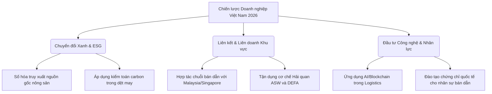

# BÁO CÁO PHÂN TÍCH CHUYÊN SÂU: KINH TẾ - CHÍNH TRỊ ĐÔNG NAM Á (SEA) NĂM 2026 VÀ TÁC ĐỘNG ĐẾN DOANH NGHIỆP VIỆT NAM

* **Tác giả:** Chuyên gia Phân tích Kinh tế - Chính trị Quốc tế (Antigravity)
* **Thời gian thực hiện:** Tháng 5 năm 2026
* **Đối tượng phân tích:** Tình hình vĩ mô khu vực Đông Nam Á (ASEAN) năm 2026, chính sách FDI, công nghệ bán dẫn, xe điện (EV), logistics và các tác động trực tiếp/gián tiếp đến cộng đồng doanh nghiệp Việt Nam.

---

## 1. Tóm tắt tổng quan khu vực Đông Nam Á năm 2026

Bước sang năm 2026, Đông Nam Á (ASEAN) đã khẳng định vị thế là một trong những động lực tăng trưởng kinh tế năng động và là mắt xích không thể thay thế trong chuỗi cung ứng toàn cầu. Dưới tác động sâu sắc của làn sóng dịch chuyển sản xuất toàn cầu ("China Plus One") và sự leo thang của các rào cản thuế quan giữa các siêu cường kinh tế, ASEAN trở thành điểm đến lý tưởng nhất cho dòng vốn đầu tư trực tiếp nước ngoài (FDI). 

### Các chỉ số và đặc điểm cốt lõi của khu vực trong năm 2026:
* **Thu hút FDI kỷ lục:** Dòng vốn FDI chảy vào khu vực tiếp tục duy trì đà tăng trưởng mạnh mẽ, vượt mốc **200 tỷ USD** hàng năm. Xu hướng chuyển dịch từ các dự án gia công thô sơ sang các dự án công nghiệp công nghệ cao và phát triển bền vững trở nên rõ nét hơn bao giờ hết.
* **Tái định vị chuỗi giá trị:** ASEAN không còn đơn thuần là một công xưởng lắp ráp chi phí thấp mà đang chuyển mình thành trung tâm đổi mới sáng tạo, nghiên cứu & phát triển (R&D) và sản xuất các sản phẩm có hàm lượng công nghệ cao như chất bán dẫn tiên tiến và xe điện (EV).
* **Liên kết nội khối ngày càng thắt chặt:** Dòng vốn FDI nội khối (Intra-ASEAN FDI) gia tăng mạnh mẽ, ví dụ các doanh nghiệp Indonesia, Thái Lan đầu tư sang Việt Nam và ngược lại, tạo thành một hệ sinh thái công nghiệp bổ trợ lẫn nhau thay vì cạnh tranh triệt tiêu.

---

## 2. Các xu hướng kinh tế - chính trị nổi bật năm 2026

### 2.1. Sự dịch chuyển chuỗi cung ứng và dòng vốn FDI công nghệ cao
Sự phân mảnh địa chính trị thế giới tiếp tục thúc đẩy các tập đoàn đa quốc gia tái cấu trúc mạng lưới sản xuất. Các ngành công nghiệp công nghệ cao, đặc biệt là điện tử, bán dẫn và năng lượng sạch, đang dịch chuyển mạnh mẽ từ Trung Quốc sang các nước thành viên chủ chốt của ASEAN bao gồm Việt Nam, Malaysia, Thái Lan và Indonesia.
* **Việt Nam & Malaysia:** Trở thành hai điểm đến hàng đầu cho các nhà đầu tư lớn trong ngành điện tử và bán dẫn nhờ vị trí địa lý đắc địa và lực lượng lao động trẻ dồi dào.
* **Thái Lan & Indonesia:** Tập trung thu hút dòng vốn vào ngành công nghiệp ô tô thế hệ mới (xe điện - EV) và chuỗi giá trị pin nhờ lợi thế tài nguyên khoáng sản thô và nền tảng công nghiệp phụ trợ ô tô có sẵn.

### 2.2. Chiến lược cạnh tranh FDI trực tiếp và chính sách ưu đãi của các nước đối thủ
Trong năm 2026, cuộc đua thu hút FDI công nghệ cao giữa các quốc gia Đông Nam Á diễn ra vô cùng khốc liệt với những chính sách hỗ trợ tài khóa và phi tài khóa chưa từng có:

#### A. Malaysia: Tiên phong trong đóng gói bán dẫn tiên tiến (Advanced Packaging)
Malaysia đang triển khai mạnh mẽ **Chiến lược Bán dẫn Quốc gia (NSS)** và các ưu đãi đặc biệt trong Ngân sách 2026 nhằm nâng cấp chuỗi giá trị bán dẫn từ lắp ráp, thử nghiệm truyền thống (ATP) lên đóng gói tiên tiến (như kiến trúc chiplet 2.5D và 3D):
* **Hỗ trợ tài chính trực tiếp:** Chính phủ Malaysia đã phê duyệt gói tài trợ nghiên cứu và phát triển (R&D) trị giá **92 triệu RM (Ringgit Malaysia)** trong vòng 24 tháng, kết hợp với hơn 93,8 triệu RM từ khu vực tư nhân nhằm hỗ trợ liên minh các công ty công nghệ trong nước (như SkyeChip, Inari Technology, FusionAP, Pentamaster...) làm chủ công nghệ đóng gói tiên tiến.
* **Phân bổ ngân sách 2026 cực lớn:** 
  * Chi **550 triệu RM** thông qua các Công ty Đầu tư của Chính phủ (GLICs) như Khazanah và KWAP để đầu tư trực tiếp vào các liên kết hệ sinh thái bán dẫn.
  * Cung cấp gói tín dụng ưu đãi chuyên biệt **500 triệu RM** thông qua Ngân hàng Phát triển Malaysia (BPMB) cho các doanh nghiệp thực hiện các hoạt động công nghệ cao thuộc NSS.
  * Chương trình **SemiconStart** được thành lập nhằm ươm tạo các startup thiết kế chip AI nội địa.
* **Mục tiêu chiến lược:** Malaysia hướng tới chiếm **7% thị phần toàn cầu** về đóng gói bán dẫn tiên tiến vào năm 2035, xây dựng tối thiểu 10 công ty nội địa có doanh thu trên 1 tỷ RM.

#### B. Thái Lan: Củng cố vị thế "Detroit của Đông Nam Á" với Xe điện (EV 3.5)
Chính sách hỗ trợ xe điện **EV 3.5 (giai đoạn 2024-2027)** của Thái Lan bước sang năm 2026 với những quy định nghiêm ngặt về sản xuất bù đắp nhưng cũng linh hoạt hơn để giữ chân nhà đầu tư:
* **Tỷ lệ sản xuất bù đắp bắt buộc (Production Offset Ratio):** Các nhà nhập khẩu ô tô điện nguyên chiếc (CBU) vào Thái Lan phải tuân thủ cam kết sản xuất nội địa theo tỷ lệ **1:2 trong năm 2026** (nhập 1 xe phải lắp ráp 2 xe tại Thái Lan) và sẽ tăng lên **1:3 vào năm 2027**. Nếu không đạt, toàn bộ trợ cấp sẽ bị đình chỉ và chịu phạt hành chính.
* **Cơ chế khuyến khích xuất khẩu mới:** Nhằm hỗ trợ các hãng xe vượt qua giai đoạn bão hòa tiêu dùng nội địa, Thái Lan cho phép **mỗi xe EV sản xuất tại Thái Lan xuất khẩu ra nước ngoài được tính hệ số 1,5 lần** để cấn trừ vào nghĩa vụ sản xuất bù đắp trong nước.
* **Chính sách pin và xe Hybrid:** Gia hạn thời gian miễn thuế nhập khẩu tế bào pin (battery cells) đến **ngày 30/6/2026** để hỗ trợ quá trình chuyển giao sang sản xuất pin hoàn chỉnh trong nước. Đồng thời, đưa ra gói ưu đãi thuế tiêu thụ đặc biệt chỉ **2%** cho xe điện thuần túy (BEVs) và hỗ trợ mạnh mẽ dòng xe Hybrid (HEV/MHEV) nếu đáp ứng tiêu chuẩn phát thải CO2 thấp.

#### C. Indonesia: Quốc hữu hóa tài nguyên và chuỗi giá trị pin
Indonesia tiếp tục duy trì chính sách cấm xuất khẩu quặng thô (đặc biệt là niken) và thúc đẩy mạnh mẽ các liên doanh FDI xây dựng nhà máy tinh chế và sản xuất pin xe điện ngay tại nội địa, tạo lợi thế tuyệt đối về chi phí nguyên liệu đầu vào.

### 2.3. Kết nối hạ tầng và hội nhập chuỗi logistics/số trong ASEAN
Năm 2026 đánh dấu bước tiến chuyển dịch mang tính bước ngoặt từ các hành lang kinh tế vật lý truyền thống sang các **"Hành lang Thịnh vượng Số" (Digital Prosperity Corridors)**:
* **Hiệp định Khung Kinh tế Số ASEAN (DEFA):** Đây là trọng tâm đàm phán và thực thi lớn nhất trong năm 2026. DEFA tạo lập một bộ quy tắc chung thống nhất về thương mại điện tử xuyên biên giới, dòng luân chuyển dữ liệu an toàn, hệ thống thanh toán số liên thông (sử dụng mã QR nội khối) và tiêu chuẩn hóa hóa đơn điện tử. Hiệp định này được kỳ vọng sẽ thúc đẩy quy mô kinh tế số ASEAN đạt **2.000 tỷ USD** vào năm 2030.
* **Hải quan và Logistics Một cửa (ASW):** Hệ thống Cơ chế một cửa ASEAN được nâng cấp toàn diện, tích hợp công nghệ Blockchain và AI để xác thực chứng từ xuất xứ (C/O Form D điện tử) và tờ khai hải quan theo thời gian thực, cắt giảm 60% thời gian thông quan hàng hóa biên giới.
* **Kế hoạch Hành động Giao thông vận tải ASEAN (ATSP) 2026-2030:** Vừa được thông qua nhằm tiêu chuẩn hóa hạ tầng logistics, thúc đẩy vận tải đa phương thức (đường sắt tốc độ cao nối liền Trung Quốc - Lào - Thái Lan - Malaysia và hệ thống cảng biển nước sâu kết nối khu vực). Đặc biệt chú trọng đến tiêu chuẩn "Logistics Xanh" (Green Logistics) nhằm đáp ứng yêu cầu giảm phát thải toàn cầu.

---

## 3. Phân tích chi tiết CƠ HỘI đối với Doanh nghiệp Việt Nam

Sự chuyển dịch kinh tế - chính trị khu vực Đông Nam Á năm 2026 mang lại những cơ hội mang tính chiến lược cho doanh nghiệp Việt Nam trên 3 nhóm ngành trọng điểm:

### 3.1. Nhóm ngành Xuất khẩu truyền thống (Dệt may, Da giày, Nông-lâm-thủy sản)
* **Gia tăng thị phần nội khối và tận dụng các FTA:** Việc thực thi các hiệp định thương mại thế hệ mới như RCEP cùng sự thông suốt của cơ chế hải quan số ASEAN giúp các doanh nghiệp dệt may, da giày Việt Nam dễ dàng nhập khẩu nguyên phụ liệu từ các nước trong khối và xuất khẩu thành phẩm ngược lại với mức thuế ưu đãi 0%.
* **Nông-lâm-thủy sản hưởng lợi từ nâng cấp logistics:** Nông sản và thủy sản là những mặt hàng nhạy cảm về thời gian bảo quản. Việc rút ngắn thời gian thông quan thông qua Cơ chế một cửa ASEAN nâng cấp (ASW) và việc ứng dụng các chuỗi cung ứng lạnh (cold-chain) tích hợp cảm biến IoT giúp nông sản Việt Nam giữ được chất lượng tươi ngon nhất khi sang các thị trường Thái Lan, Singapore, Malaysia, giảm thiểu tỷ lệ hao hụt từ 15% xuống dưới 5%.
* **Nhu cầu lương thực tăng cao:** Xu hướng đa dạng hóa nguồn cung thực phẩm an toàn của Singapore và Malaysia mở ra cơ hội lớn cho gạo chất lượng cao, rau quả hữu cơ và thủy sản chế biến sâu của Việt Nam.

### 3.2. Nhóm ngành Điện tử & Bán dẫn
* **Mắt xích liên kết chuỗi giá trị toàn cầu:** Sự phát triển vượt bậc của trung tâm bán dẫn Malaysia (về đóng gói tiên tiến) và Singapore (về R&D) không hẳn là mối đe dọa, mà mở ra cơ hội hợp tác thiết lập chuỗi giá trị bổ trợ. Việt Nam có thể tập trung vào các khâu thiết kế chip AI (khâu thiết kế thượng nguồn vốn ít thâm dụng vốn hơn nhưng biên lợi nhuận cao) và lắp ráp bo mạch điện tử (PCBA) phân khúc trung du.
* **Thu hút dòng vốn dịch chuyển sản xuất thiết bị gốc (OEM/ODM):** Dòng vốn FDI tìm kiếm phương án "phòng ngừa rủi ro" từ Trung Quốc sẽ tiếp tục đổ mạnh vào các khu công nghiệp phía Bắc và phía Nam Việt Nam, tạo cơ hội cho các doanh nghiệp phụ trợ cơ khí chính xác, nhựa kỹ thuật cao của Việt Nam tham gia sâu hơn vào chuỗi cung ứng của các ông lớn như Samsung, Foxconn, Intel.

### 3.3. Nhóm ngành Logistics & Chuỗi cung ứng
* **Khai thác dòng dịch chuyển cảng biển nước sâu:** Việt Nam sở hữu vị trí địa lý đắc địa bậc nhất trên tuyến hàng hải quốc tế. Các siêu cảng nước sâu như Lạch Huyện (Hải Phòng), Cái Mép - Thị Vải (Bà Rịa - Vũng Tàu) và dự án Cảng trung chuyển quốc tế Cần Giờ là cơ hội vàng để Việt Nam thu hút dòng tàu container cỡ lớn trực tiếp đi Mỹ, châu Âu mà không cần trung chuyển qua Singapore, giúp doanh nghiệp logistics nội địa tăng quy mô doanh thu.
* **Đón đầu hạ tầng số và thương mại điện tử xuyên biên giới:** Các doanh nghiệp logistics công nghệ (LogTech) Việt Nam có cơ hội lớn khi tích hợp hệ sinh thái dịch vụ vào Hành lang số ASEAN (DEFA). Sự thống nhất về thanh toán và hóa đơn điện tử giúp việc thực hiện dịch vụ chuyển phát nhanh xuyên biên giới (Cross-border E-commerce logistics) sang Lào, Campuchia, Thái Lan trở nên dễ dàng và nhanh chóng như giao hàng nội địa.

---

## 4. Phân tích chi tiết RỦI RO đối với Doanh nghiệp Việt Nam

Bên cạnh những cơ hội rộng mở, doanh nghiệp Việt Nam trong năm 2026 phải đối mặt với những thách thức và rủi ro cạnh tranh gay gắt từ chính các quốc gia láng giềng trong khối:

### 4.1. Nhóm ngành Xuất khẩu truyền thống
* **Sức ép từ các nước có chi phí nhân công cực thấp:** Các ngành thâm dụng lao động như dệt may, da giày giá rẻ của Việt Nam đang bị cạnh tranh trực tiếp bởi các nước như Campuchia, Myanmar và Bangladesh (các nước vẫn giữ được ưu thế về chi phí lao động cực thấp và các ưu đãi thuế quan đặc biệt EBA của EU).
* **Rào cản tiêu chuẩn xanh (ESG) và truy xuất nguồn gốc:** Từ năm 2026, các tiêu chuẩn về phát thải carbon và chống phá rừng (như luật EUDR của châu Âu, cơ chế CBAM) bắt đầu áp dụng thực tế. Trong khi Thái Lan đã tiến xa trong việc xây dựng bản đồ nông nghiệp số và chứng chỉ carbon, phần lớn doanh nghiệp nông nghiệp, dệt may Việt Nam vẫn đang loay hoay trong khâu chuyển đổi, dẫn tới nguy cơ bị loại khỏi các chuỗi mua hàng cao cấp.

### 4.2. Nhóm ngành Điện tử & Bán dẫn
* **Nguy cơ thua cuộc trong cuộc đua trợ cấp và ưu đãi tài chính:** Việt Nam đang gặp bất lợi rõ rệt trước các chính sách trợ cấp tài chính trực tiếp cực khủng từ Malaysia (92 triệu RM trợ cấp R&D đóng gói tiên tiến, 550 triệu RM từ GLICs đầu tư hệ sinh thái, 500 triệu RM vay ưu đãi). Nếu Việt Nam không sớm ban hành cơ chế hỗ trợ tài chính tương xứng (như Quỹ hỗ trợ đầu tư để bù đắp ảnh hưởng của Thuế tối thiểu toàn cầu GMT), dòng vốn FDI chất lượng cao có thể chọn Malaysia hoặc Thái Lan làm điểm đến tiếp theo.
* **Khủng hoảng thiếu hụt nhân lực chất lượng cao:** Ngành bán dẫn và AI đòi hỏi đội ngũ kỹ sư có trình độ chuyên môn sâu. Việt Nam dù có mục tiêu đào tạo 50.000 kỹ sư bán dẫn đến năm 2030 nhưng thực tế năm 2026, số lượng kỹ sư thực chiến đáp ứng được tiêu chuẩn công nghiệp vẫn rất hạn chế. Điều này dẫn đến hiện tượng tranh giành nhân tài, đẩy chi phí nhân sự lên cao và gây khó khăn cho các doanh nghiệp công nghệ trong nước.

### 4.3. Nhóm ngành Logistics & Chuỗi cung ứng
* **Chi phí logistics vẫn ở mức quá cao:** Chi phí logistics của Việt Nam trong năm 2026 vẫn dao động ở mức **16-18% GDP**, cao hơn đáng kể so với Thái Lan (khoảng 11-12% GDP) và Singapore (dưới 8% GDP). Sự thiếu đồng bộ giữa hạ tầng cảng biển và hạ tầng giao thông kết nối đường bộ, đường sắt khiến thời gian vận chuyển nội địa bị kéo dài, làm giảm tính cạnh tranh của hàng hóa Việt Nam.
* **Sự chậm trễ trong chuyển đổi hạ tầng số:** Dù DEFA mang lại cơ hội lớn, nhưng nếu các doanh nghiệp logistics Việt Nam chậm chạp trong việc nâng cấp hệ thống quản lý kho bãi (WMS), quản lý vận tải (TMS) tích hợp AI và Blockchain, họ sẽ có nguy cơ bị các tập đoàn logistics đa quốc gia của Singapore và Thái Lan thâu tóm thị phần ngay trên sân nhà.
* **Hạ tầng kết nối xuyên biên giới yếu kém:** Tuyến đường sắt và đường bộ kết nối hành lang kinh tế Đông - Tây (EWEC) đi qua Việt Nam, Lào, Thái Lan, Myanmar vẫn chưa thực sự thông suốt do sự khác biệt về khổ đường sắt và thủ tục kiểm soát biên giới tại các cửa khẩu đất liền, hạn chế khả năng trung chuyển logistics đường bộ khu vực.

---

## 5. Đánh giá mức độ tác động chung và Khuyến nghị chiến lược

### 5.1. Đánh giá mức độ tác động chung: CAO (High Impact)
Sự biến động kinh tế - chính trị của Đông Nam Á năm 2026 có mức độ tác động **CAO** đối với các doanh nghiệp Việt Nam. Khu vực này vừa là thị trường xuất khẩu, vừa là đối thủ cạnh tranh trực tiếp nhất của Việt Nam trong việc thu hút dòng vốn FDI công nghệ cao dịch chuyển từ Trung Quốc. Bất kỳ sự chậm trễ nào trong việc cải cách chính sách ưu đãi đầu tư, đào tạo nguồn nhân lực chất lượng cao hay chuyển đổi xanh đều có thể khiến Việt Nam mất đi cơ hội vàng mang tính lịch sử này.

---

### 5.2. Khuyến nghị chiến lược đối với Doanh nghiệp Việt Nam

#### 1. Đối với Doanh nghiệp Xuất khẩu:
* **Tăng tốc chuyển đổi xanh:** Chủ động áp dụng quy trình sản xuất tuần hoàn, kiểm kê khí nhà kính và chuyển sang sử dụng năng lượng tái tạo. Doanh nghiệp nông nghiệp cần phối hợp chặt chẽ với nông dân để số hóa vùng trồng, đảm bảo tuân thủ tuyệt đối các quy định chống phá rừng (EUDR) để bảo vệ thị phần xuất khẩu quốc tế.
* **Khai thác sâu thị trường nội khối:** Thay vì chỉ tập trung vào thị trường Mỹ, EU, doanh nghiệp cần chú trọng nghiên cứu thị hiếu tiêu dùng của các nước ASEAN (đặc biệt là chứng chỉ Halal cho thị trường thực phẩm Malaysia, Indonesia).

#### 2. Đối với Doanh nghiệp Điện tử & Bán dẫn:
* **Định vị phân khúc ngách thông minh:** Thay vì cố gắng cạnh tranh trực tiếp ở mảng đúc chip (foundry) đòi hỏi hàng chục tỷ USD vốn đầu tư, doanh nghiệp Việt Nam nên tập trung nguồn lực vào thiết kế vi mạch (IC Design) cho các ứng dụng IoT, thiết bị gia dụng thông minh và viễn thông.
* **Liên minh công nghệ khu vực:** Thiết lập các văn phòng hoặc liên doanh R&D tại Malaysia và Singapore để tận dụng hệ sinh thái đóng gói tiên tiến và nguồn lực tài chính khu vực nhằm nâng cấp công nghệ cho đội ngũ nhân sự trong nước.

#### 3. Đối với Doanh nghiệp Logistics:
* **Chuyển đổi số toàn diện theo chuẩn DEFA:** Chủ động đầu tư vào hạ tầng phần mềm quản lý thông minh để kết nối mượt mà với Cơ chế một cửa ASEAN (ASW). Số hóa toàn bộ chứng từ vận tải, áp dụng ký số xuyên biên giới để rút ngắn tối đa quy trình thủ tục.
* **Đầu tư vào chuỗi cung ứng lạnh:** Tập trung phát triển phân khúc logistics chuỗi lạnh chuyên biệt phục vụ xuất khẩu nông - thủy sản nhằm tạo ra giá trị gia tăng vượt trội so với vận tải container thường.

---

### 5.3. Khuyến nghị chính sách đối với Chính phủ Việt Nam
* **Thiết lập nhanh Quỹ hỗ trợ đầu tư:** Sớm ban hành cơ chế hỗ trợ tài chính trực tiếp cho các dự án công nghệ cao, bán dẫn để hóa giải tác động tiêu cực của Thuế tối thiểu toàn cầu (GMT), tạo lợi thế sòng phẳng với các gói hỗ trợ của Malaysia và Thái Lan.
* **Đột phá trong đào tạo nguồn nhân lực bán dẫn:** Liên kết chặt chẽ các trường đại học công nghệ hàng đầu Việt Nam với các tập đoàn bán dẫn đa quốc gia nhằm xây dựng các chương trình đào tạo "kép" (vừa học vừa làm), cấp chứng chỉ quốc tế để rút ngắn thời gian làm chủ công nghệ của kỹ sư trong nước.
* **Nâng cấp kết nối giao thông liên thông:** Đẩy mạnh đầu tư các tuyến cao tốc, đường sắt kết nối trực tiếp với Lào và Campuchia để tối ưu hóa Hành lang kinh tế Đông - Tây, đưa Việt Nam thực sự trở thành trung tâm logistics trung chuyển của tiểu vùng sông Mê Kông.

---
*Báo cáo kết thúc.*
