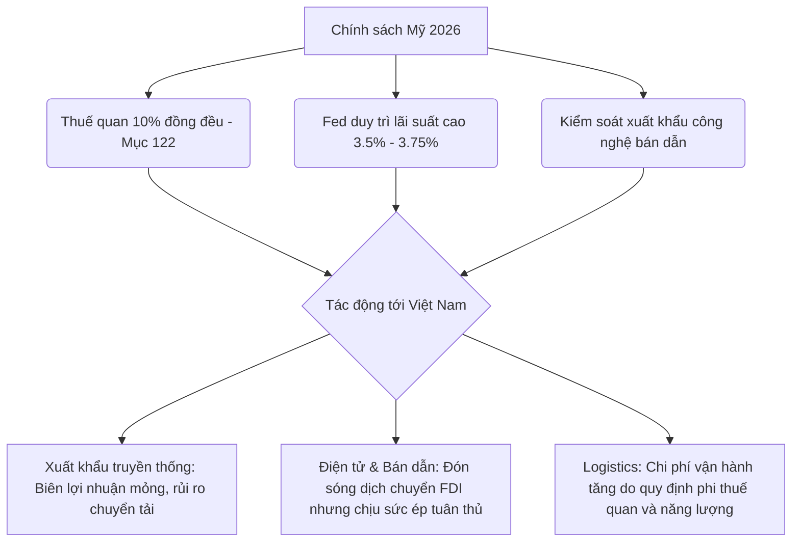
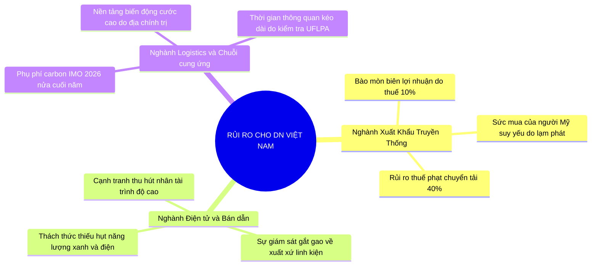
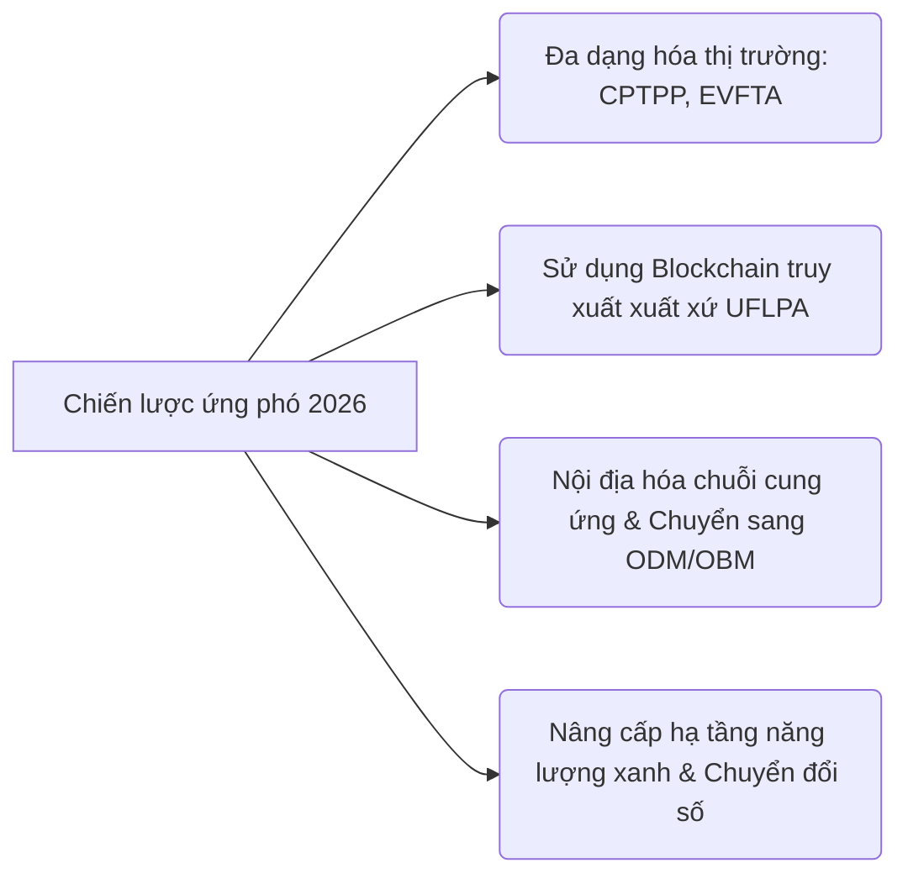

# BÁO CÁO PHÂN TÍCH CHUYÊN SÂU: KINH TẾ - CHÍNH TRỊ MỸ NĂM 2026 VÀ TÁC ĐỘNG TỚI DOANH NGHIỆP VIỆT NAM
*Tác giả: Chuyên gia Phân tích Kinh tế - Chính trị Quốc tế (Antigravity)*  
*Thời gian thực hiện: Tháng 5 năm 2026*  

---

## I. TÓM TẮT TỔNG QUAN KHU VỰC MỸ NĂM 2026

Bước sang năm 2026, nền kinh tế và bối cảnh chính trị của Hợp chủng quốc Hoa Kỳ (USA) đang trải qua một giai đoạn chuyển dịch cực kỳ phức tạp và đầy biến động. Chính quyền Trump 2.0 tiếp tục thúc đẩy mạnh mẽ chương trình nghị sự "Nước Mỹ trên hết" (America First), định hình lại bản đồ thương mại toàn cầu thông qua các công cụ bảo hộ quyết liệt.

### 1. Bức tranh kinh tế vĩ mô: Lạm phát quay lại và phản ứng của Fed
*   **Lạm phát gia tăng trở lại:** Tính đến tháng 4 năm 2026, tỷ lệ lạm phát hàng năm của Mỹ đã tăng tốc lên mức **3,8%** (mức cao nhất trong vòng 3 năm qua). Sự trỗi dậy của lạm phát bắt nguồn từ hai yếu tố cốt lõi: chi phí năng lượng tăng cao do căng thẳng quân sự leo thang với Iran tại Trung Đông và tác động tích lũy từ các chính sách thuế quan nhập khẩu mới được triển khai.
*   **Phản ứng của Cục Dự trữ Liên bang (Fed):** Dưới sự dẫn dắt của tân Chủ tịch Fed **Kevin Warsh**, cơ quan này đang duy trì lãi suất quỹ liên bang trong phạm vi **3,5% - 3,75%** ở trạng thái "chờ đợi và quan sát" (wait-and-see). Trái ngược với kỳ vọng cắt giảm lãi suất của thị trường vào đầu năm 2026, lạm phát dai dẳng đã buộc Fed phải giữ nguyên mức lãi suất này, thậm chí có khả năng kéo dài sang năm 2027 hoặc tăng nhẹ nếu lạm phát không hạ nhiệt. Điều này làm xói mòn thu nhập thực tế của hộ gia đình Mỹ trong 3 tháng liên tiếp tính đến tháng 5 năm 2026, kìm hãm sức mua của người tiêu dùng Mỹ.

### 2. Chính sách bảo hộ thương mại mang tính đột phá
*   **Thuế quan đồng loạt 10% (Mục 122):** Sau khi Tòa án Tối cao Mỹ ra phán quyết tuyên bố việc áp dụng thuế quan diện rộng dưới Đạo luật Quyền lực Kinh tế Khẩn cấp Quốc tế (IEEPA) là bất hợp pháp, chính quyền Trump đã nhanh chóng chuyển hướng sang áp dụng **Đạo luật Thương mại năm 1974 (Mục 122)**. 
*   Một mức **thuế quan đồng đều 10%** (uniform tariff) tạm thời đối với hầu hết hàng hóa nhập khẩu (bao gồm cả hàng hóa từ Việt Nam) đã chính thức có hiệu lực từ ngày **24 tháng 2 năm 2026** trong thời hạn **150 ngày** (dự kiến hết hạn ngày 24 tháng 7 năm 2026). Hiện tại, đang có những lo ngại lớn rằng chính quyền Mỹ có thể nâng mức thuế này lên **15%** nếu thâm hụt thương mại không được cải thiện đáng kể.

### 3. Cục diện địa chính trị: Đình chiến thương mại Mỹ - Trung tạm thời
*   **Hạ nhiệt căng thẳng ngắn hạn:** Hội nghị thượng đỉnh Mỹ - Trung vào tháng 5 năm 2026 tại Bắc Kinh giữa Tổng thống Donald Trump và Chủ tịch Tập Cận Bình đã mang lại một tín hiệu tích cực ngoài mong đợi. Hai bên đạt được một thỏa thuận **"đình chiến thương mại" (trade truce)** kéo dài ít nhất đến **tháng 11 năm 2026** (thời điểm diễn ra cuộc bầu cử giữa nhiệm kỳ của Mỹ).
*   **Căng thẳng công nghệ cốt lõi vẫn tiếp diễn:** Mặc dù căng thẳng thuế quan tạm lắng, các lệnh trừng phạt công nghệ, kiểm soát xuất khẩu chip bán dẫn và thiết bị AI từ phía Mỹ nhắm vào Trung Quốc vẫn không hề suy giảm. Xu hướng dịch chuyển chuỗi cung ứng sang các nước thứ ba ("China Plus One") vẫn là một dòng chảy không thể đảo ngược.

---

## II. CÁC XU HƯỚNG KINH TẾ - CHÍNH TRỊ NỔI BẬT TẠI MỸ NĂM 2026

Bảng dưới đây tổng hợp các xu hướng chính trị - kinh tế lớn tại Mỹ trong năm 2026 và tính chất tác động của chúng đối với thị trường toàn cầu:

| Xu hướng chủ đạo | Chi tiết sự kiện & Chỉ số chính | Bản chất tác động toàn cầu |
| :--- | :--- | :--- |
| **Bảo hộ Thuế quan kiểu mới** | Áp thuế 10% theo Mục 122 (Trade Act 1974) từ 24/2/2026; mở rộng thuế Mục 232 lên thép, nhôm, đồng. | Gây gián đoạn chuỗi cung ứng toàn cầu, đẩy chi phí sản xuất lên cao và tạo áp lực lạm phát nhập khẩu. |
| **Fed kiên định Lãi suất cao** | Lãi suất neo ở mức **3,5% - 3,75%** dưới thời Kevin Warsh; trì hoãn giảm lãi suất tới năm 2027. | Giữ giá trị đồng USD mạnh, tăng chi phí đi vay toàn cầu và gây áp lực lên tỷ giá của các nước đang phát triển (trong đó có VNĐ). |
| **Chiến tranh Năng lượng & Địa chính trị** | Xung đột trực tiếp/gián tiếp với Iran làm gián đoạn nguồn cung dầu khí toàn cầu. | Giá dầu neo ở mức cao, làm trầm trọng thêm chi phí vận tải logistics và chi phí nguyên liệu đầu vào. |
| **Ổn định Mỹ - Trung chiến thuật** | Thỏa thuận đình chiến thương mại tạm thời đến tháng 11/2026; thiết lập các ban quản lý tranh chấp. | Mang lại sự ổn định ngắn hạn cho dòng chảy thương mại toàn cầu nhưng duy trì sự phân tách (decoupling) trong các lĩnh vực công nghệ cốt lõi. |
| **Siêu chu kỳ Đầu tư Công nghệ** | Sự bùng nổ của hạ tầng AI và trung tâm dữ liệu bất chấp lãi suất cao. | Thu hút dòng vốn FDI toàn cầu đổ về Mỹ (Re-shoring) và thúc đẩy nhu cầu khổng lồ về linh kiện bán dẫn. |

---

## III. PHÂN TÍCH CHI TIẾT RỦI RO ĐỐI VỚI DOANH NGHIỆP VIỆT NAM

Chính sách bảo hộ thương mại khắt khe và các biến động vĩ mô từ Mỹ năm 2026 đặt ra những thách thức nghiêm trọng cho cộng đồng doanh nghiệp Việt Nam, cụ thể trên 3 nhóm ngành:

### 1. Nhóm ngành Xuất khẩu truyền thống (Dệt may, Da giày, Nông-lâm-thủy sản)
> [!WARNING]
> Đây là nhóm ngành dễ tổn thương nhất trong năm 2026 do biên lợi nhuận thấp và phụ thuộc lớn vào khả năng cạnh tranh về giá tại thị trường Mỹ.

*   **Rủi ro thuế quan ăn mòn biên lợi nhuận:** Việc áp thuế 10% đồng loạt từ tháng 2/2026 đã giáng một đòn mạnh vào các doanh nghiệp gia công dệt may và da giày Việt Nam. Với biên lợi nhuận ròng vốn chỉ dao động từ 3% - 5%, các doanh nghiệp không thể tự hấp thụ mức thuế này. Trong khi đó, việc đàm phán tăng giá bán với các nhà mua hàng Mỹ gặp bế tắc do người tiêu dùng Mỹ đang thắt chặt chi tiêu trước áp lực lạm phát 3,8%.
*   **Bẫy "chuyển tải bất hợp pháp" (Transshipment) và xuất xứ nguyên liệu:** Do dệt may và da giày Việt Nam vẫn phụ thuộc tới 50% - 60% vào nguồn nguyên phụ liệu nhập khẩu từ Trung Quốc, các doanh nghiệp đang lọt vào tầm ngắm kiểm tra nguồn gốc của Hải quan Mỹ. Nếu bị nghi ngờ là "trung chuyển hàng Trung Quốc để né thuế" (Made in China by proxy), doanh nghiệp Việt Nam đối mặt với mức **thuế phạt phòng vệ thương mại lên tới 40%**, thậm chí bị cấm xuất khẩu sang Mỹ.
*   **Sự suy giảm nhu cầu tiêu dùng nông-thủy sản:** Các mặt hàng thủy sản (tôm, cá tra) và sản phẩm gỗ nội thất – vốn là thế mạnh của Việt Nam tại Mỹ – đang bị sụt giảm đơn hàng đáng kể. Người tiêu dùng Mỹ ưu tiên các mặt hàng thiết yếu, cắt giảm chi phí mua sắm đồ gỗ và chuyển sang các nguồn thực phẩm thay thế có giá rẻ hơn.

### 2. Nhóm ngành Điện tử & Bán dẫn
*   **Sức ép chứng minh xuất xứ chuỗi cung ứng phi Trung Quốc:** Mỹ áp dụng các quy định nghiêm ngặt về truy xuất nguồn gốc linh kiện đối với các mặt hàng điện tử tiêu dùng và thiết bị viễn thông. Các doanh nghiệp lắp ráp điện tử tại Việt Nam sử dụng linh kiện bán dẫn hoặc bảng mạch có nguồn gốc từ các thực thể Trung Quốc nằm trong danh sách hạn chế của Mỹ sẽ đối mặt với nguy cơ bị tịch thu hàng hóa hoặc cấm vận thương mại.
*   **Thách thức nội tại về Hạ tầng và Năng lượng:** Ngành công nghiệp bán dẫn yêu cầu nguồn cung cấp điện cực kỳ ổn định và liên tục. Việc Việt Nam đang nỗ lực chuyển dịch năng lượng nhưng chưa đáp ứng đủ yêu cầu về tỷ lệ năng lượng tái tạo (RE100) cho các nhà máy FDI bán dẫn toàn cầu (như Samsung, Intel) có thể làm giảm tiến độ giải ngân dòng vốn thực tế.
*   **Sự cạnh tranh gay gắt từ làn sóng "Friend-shoring" và "Re-shoring":** Các chính sách trợ cấp khổng lồ từ Đạo luật Chip (CHIPS Act) của Mỹ đang thu hút ngược dòng vốn công nghệ về lại nước Mỹ hoặc dịch chuyển sang các đồng minh gần gũi hơn của Mỹ ở châu Mỹ Latinh (như Mexico) nhờ lợi thế địa lý và hiệp định thương mại tự do USMCA.

### 3. Nhóm ngành Logistics & Chuỗi cung ứng
*   **Chi phí vận hành tăng vọt bất chấp cước tàu giảm:** Mặc dù có sự dư thừa công suất đội tàu toàn cầu làm giảm giá cước giao ngay (spot rate), chi phí logistics thực tế của doanh nghiệp Việt Nam đi tuyến Mỹ vẫn tăng do:
    *   Giá nhiên liệu neo ở mức cao do bất ổn tại Trung Đông.
    *   Phí bảo hiểm hàng hải tăng mạnh.
    *   **Phụ phí carbon IMO 2026** bắt đầu được áp dụng nghiêm ngặt vào nửa cuối năm 2026, buộc các hãng tàu phải thu thêm phụ phí bảo vệ môi trường đối với các tuyến đường dài.
*   **Rào cản phi thuế quan và quy trình thông quan kéo dài:** Việc thắt chặt kiểm tra Đạo luật chống lao động cưỡng bức Duy Ngô Nhĩ (UFLPA) của Mỹ đối với các sản phẩm chứa bông, polysilicon, nhôm đã lan rộng sang cả ngành linh kiện điện tử và tấm pin mặt trời sản xuất tại Việt Nam. Quy trình thẩm định hồ sơ thông quan kéo dài từ vài ngày lên vài tuần, làm phát sinh chi phí lưu kho bãi cực kỳ lớn cho doanh nghiệp Việt Nam tại các cảng biển Mỹ.

---

## IV. PHÂN TÍCH CHI TIẾT CƠ HỘI ĐỐI VỚI DOANH NGHIỆP VIỆT NAM

Mặc dù rủi ro là rất lớn, bối cảnh kinh tế - chính trị Mỹ năm 2026 cũng mở ra những cơ hội mang tính chiến lược cho các doanh nghiệp Việt Nam biết chủ động thích ứng và nâng cấp chuỗi giá trị:

> [!TIP]
> Việc Mỹ áp dụng chính sách thuế quan khắt khe với Trung Quốc chính là động lực mạnh mẽ nhất thúc đẩy các tập đoàn đa quốc gia hoàn thiện chuỗi cung ứng khép kín tại Việt Nam thay vì chỉ lắp ráp đơn thuần.

### 1. Nhóm ngành Điện tử & Bán dẫn: Kỷ nguyên vàng của FDI chất lượng cao
*   **Đón nhận làn sóng siêu dự án dịch chuyển:** Tính đến đầu năm 2026, Việt Nam đã trở thành điểm đến hàng đầu của dòng vốn FDI bán dẫn với lũy kế đạt **14 - 16 tỷ USD**. Siêu dự án nhà máy đóng gói và kiểm thử chip trị giá **4 tỷ USD của Samsung** tại Thái Nguyên đi vào hoạt động đầu năm 2026 đã khẳng định vị thế của Việt Nam. Sự dịch chuyển này không chỉ mang lại dòng vốn và còn giúp Việt Nam chuyển mình từ lắp ráp đơn giản sang phân khúc có giá trị gia tăng cao hơn.
*   **Lợi thế từ các chính sách ưu đãi lịch sử:** Sự ra đời của **Luật Công nghiệp Công nghệ số** (hiệu lực từ 1/1/2026) với mức thuế suất ưu đãi doanh nghiệp kỷ lục **5% trong vòng 37 năm** đối với các dự án R&D công nghệ cao lớn chính là thỏi nam châm thu hút các gã khổng lồ thiết kế chip của Mỹ như NVIDIA, Qualcomm, Synopsys đầu tư vào Việt năng.
*   **Sự tự chủ công nghệ bước đầu:** Việc tập đoàn **Viettel** khởi công nhà máy sản xuất bán dẫn công nghệ cao đầu tiên của Việt Nam trong năm 2026 cho thấy bước tiến dài trong việc làm chủ chuỗi cung ứng bán dẫn nội địa, giảm bớt sự phụ thuộc vào nguồn cung bên ngoài và giảm thiểu rủi ro pháp lý từ phía Mỹ.

### 2. Nhóm ngành Xuất khẩu truyền thống: Cơ hội định vị lại thương hiệu và cơ cấu thương mại
*   **Thúc đẩy đàm phán Hiệp định song phương cân bằng:** Để ứng phó với mức thuế 10% của Mỹ, Chính phủ và các doanh nghiệp lớn của Việt Nam đang tăng cường nhập khẩu ngược lại các mặt hàng nông sản (ngô, đậu tương), bông sợi và máy móc thiết bị công nghệ cao từ Mỹ. Hành động này giúp thu hẹp thặng dư thương mại của Việt Nam với Mỹ, tạo điều kiện thuận lợi cho các cuộc đàm phán hướng tới **Hiệp định Thương mại Song phương Cân bằng và Công bằng (Reciprocal, Fair, and Balanced Trade Agreement)**, mở ra cơ hội miễn giảm thuế quan cho các doanh nghiệp dệt may, thủy sản Việt Nam trong tương lai.
*   **Động lực đa dạng hóa thị trường và nâng cấp chuỗi cung ứng:** Áp lực thuế quan tại Mỹ buộc các doanh nghiệp dệt may, da giày Việt Nam phải chủ động tìm kiếm và khai thác sâu hơn các thị trường đã ký FTA như EU (EVFTA), các nước trong khối CPTPP (Nhật Bản, Canada, Úc). Đồng thời, các doanh nghiệp buộc phải đầu tư phát triển nguồn nguyên liệu nội địa hoặc chuyển dịch từ phương thức gia công đơn thuần (CMT) sang tự thiết kế và sản xuất (ODM/OBM) nhằm đáp ứng quy tắc xuất xứ khắt khe.

### 3. Nhóm ngành Logistics & Chuỗi cung ứng: Sự trỗi dậy của Logistics xanh và số hóa
*   **Ứng dụng công nghệ để nâng cao năng lực tuân thủ:** Nhằm vượt qua các rào cản kỹ thuật của Mỹ (UFLPA, xuất xứ chuỗi cung ứng), các doanh nghiệp logistics và xuất khẩu Việt Nam đã bắt đầu áp dụng rộng rãi các giải pháp công nghệ như **Blockchain để truy xuất nguồn gốc sản phẩm** từ khâu nguyên liệu thô đến thành phẩm. Điều này biến rào cản kỹ thuật thành lợi thế cạnh tranh vượt trội của hàng hóa Việt Nam so với các đối thủ khác trong khu vực.
*   **Cơ hội phát triển hạ tầng Logistics hiện đại:** Làn sóng dịch chuyển chuỗi cung ứng bán dẫn và điện tử đòi hỏi hệ thống logistics tích hợp chuyên sâu (như kho lạnh tiêu chuẩn cao, vận chuyển kiểm soát nhiệt độ, quy trình thông quan ưu tiên). Các doanh nghiệp logistics Việt Nam liên doanh với các đối tác Mỹ và toàn cầu có cơ hội nâng cấp hạ tầng cảng biển, hàng không và dịch vụ chuỗi cung ứng thông minh, nâng cao biên lợi nhuận dịch vụ.

---

## V. ĐÁNH GIÁ MỨC ĐỘ TÁC ĐỘNG CHUNG VÀ KHUYẾN NGHỊ CHIẾN LƯỢC

### 1. Đánh giá mức độ tác động chung: **TRUNG BÌNH - CAO (Medium to High)**

Tác động từ kinh tế - chính trị Mỹ năm 2026 đối với doanh nghiệp Việt Nam mang tính chất hai mặt rõ rệt và cực kỳ sâu sắc:
*   **Ngắn hạn (Tác động Tiêu cực - CAO):** Áp lực trực tiếp từ mức thuế quan 10% (Mục 122) và lạm phát Mỹ dai dẳng làm suy giảm biên lợi nhuận của các ngành xuất khẩu truyền thống (Dệt may, Da giày, Thủy sản, Gỗ). Lãi suất Fed duy trì ở mức cao gây sức ép lên tỷ giá VNĐ/USD, đẩy chi phí tài chính và chi phí nhập khẩu nguyên liệu của doanh nghiệp Việt Nam tăng cao.
*   **Dài hạn (Tác động Tích cực - TRUNG BÌNH đến CAO):** Mỹ tiếp tục đẩy mạnh chính sách dịch chuyển chuỗi cung ứng ra khỏi Trung Quốc tạo ra cơ hội lịch sử để Việt Nam nâng cấp vị thế trong chuỗi giá trị toàn cầu, đặc biệt là trong lĩnh vực điện tử, thiết kế và đóng gói bán dẫn. Luật Công nghiệp Công nghệ số năm 2026 của Việt Nam đang cộng hưởng rất tốt với xu hướng này để thu hút dòng vốn FDI công nghệ cao chất lượng bền vững.

---

### 2. Khuyến nghị chiến lược cho Doanh nghiệp Việt Nam năm 2026

> [!IMPORTANT]
> **Khẩu quyết hành động cho năm 2026: "Tuân thủ tuyệt đối - Đa dạng hóa nguồn cung - Nâng cấp công nghệ số".**

1.  **Chủ động rà soát và minh bạch hóa chuỗi cung ứng:**
    *   Doanh nghiệp xuất khẩu dệt may, da giày, linh kiện điện tử cần triển khai ngay các công cụ truy xuất nguồn gốc bằng công nghệ số (như Blockchain, mã định danh RFID). Đảm bảo mọi nguyên liệu nhập khẩu đầu vào (đặc biệt là từ Trung Quốc) đều có hồ sơ chứng minh xuất xứ sạch, không vi phạm đạo luật UFLPA và không rơi vào bẫy thuế quan chuyển tải của Mỹ.
2.  **Đa dạng hóa thị trường xuất khẩu và nguồn cung nguyên liệu:**
    *   Tận dụng triệt để các FTA đã có hiệu lực như EVFTA, CPTPP, RCEP để giảm bớt sự phụ thuộc quá lớn vào thị trường Mỹ. Cần chủ động chuyển dịch nguồn nhập khẩu nguyên liệu sang các quốc gia Đông Nam Á hoặc các nước nằm trong các hiệp định thương mại tự do mà Việt Nam là thành viên để tối ưu hóa thuế suất.
3.  **Tăng cường nhập khẩu song phương từ Mỹ:**
    *   Các doanh nghiệp sản xuất thức ăn chăn nuôi, dệt may nên tăng tỷ lệ nhập khẩu ngô, đậu tương và bông sợi từ Mỹ. Việc này không chỉ giúp doanh nghiệp tiếp cận nguồn nguyên liệu chất lượng cao mà còn góp phần quan trọng hỗ trợ Chính phủ Việt Nam cân bằng cán quan thương mại song phương, tạo lợi thế đàm phán giảm thuế với chính quyền Mỹ.
4.  **Đẩy mạnh chuyển đổi xanh để vượt rào cản kỹ thuật:**
    *   Các doanh nghiệp logistics và sản xuất cần chủ động đầu tư giải pháp tiết kiệm năng lượng, chuyển sang sử dụng năng lượng tái tạo và áp dụng quy trình kiểm kê khí nhà kính. Điều này giúp doanh nghiệp sẵn sàng đáp ứng các phụ phí carbon mới (IMO 2026) và các tiêu chuẩn ESG ngày càng khắt khe của thị trường Mỹ.
5.  **Tận dụng ưu đãi của Luật Công nghiệp Công nghệ số:**
    *   Các doanh nghiệp công nghệ trong nước cần chủ động liên kết, hợp tác làm nhà cung ứng cấp 2, cấp 3 cho các tập đoàn FDI bán dẫn lớn (Samsung, Intel, Viettel). Đồng thời tận dụng tối đa các ưu đãi thuế thu nhập doanh nghiệp và tiền thuê đất từ Luật Công nghiệp Công nghệ số (hiệu lực 1/1/2026) để đầu tư nghiên cứu phát triển (R&D) và nâng cao trình độ nhân lực kỹ thuật số.

---
*(Báo cáo được tổng hợp dựa trên dữ liệu cập nhật từ các nguồn uy tín: Federal Reserve, US Trade Representative, Tổng cục Thống kê Việt Nam, Bộ Công Thương Việt Nam năm 2026).*
